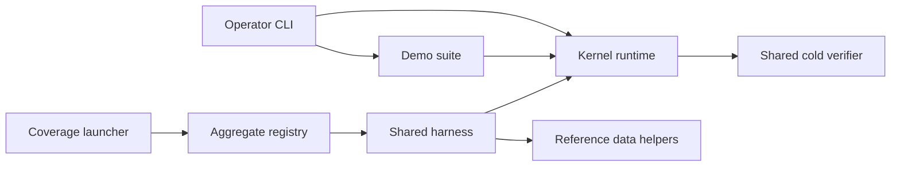

# Sigil Crucible

_Licensed under AGPLv3; see [license](../LICENSE/LICENSE_INDEX.md)._

Rose Sigil Systems (RSS) is the overall project. Sigil Crucible names RSS's
development mechanism: the instructions and tools used to build, test, measure
and review the kernel and related code. Its responsibility is external to the
kernel's runtime role, while the executable tools remain versioned alongside
the code they check. In conventional engineering language, it is a development
and verification toolchain. Existing scripts provide parts of that mechanism;
its consolidated responsibility map is a design candidate, not a new runtime
capability.

**The name and BUILD-03-A through BUILD-03-E constraints are human-selected.
The documentation/map candidate and both correction deltas received independent
PASS reviews. Classifications remain provisional; ROADMAP owns checkpoint state
and the remaining BUILD-03 decisions.**

This document owns Crucible's identity, responsibility contract and BUILD
document routes. [ROADMAP](../ROADMAP.md#current-build-thread) alone owns task
selection, state and disposition. [TESTING](TESTING.md) owns runnable commands,
effects and detailed execution evidence. [BUILD_DISCIPLINE](BUILD_DISCIPLINE.md)
owns review and promotion procedure. The [external terminology map](EXTERNAL_MAP.md#development-terminology)
translates the names without renaming code.

## Project context and map scope

This owner maps Sigil Crucible's development and proof responsibilities. The
[architecture reconciliation route](PROJECT_CONTROL_SURFACE.md#named-architecture-map-reconciliation)
coordinates the wider project and runtime views through their existing owners.
Use [canonical RSS terms](EXTERNAL_MAP.md#core-translation) and
[subsystem handles](SUBSYSTEM_HANDLES.md#canonical-handles) first, with familiar
engineering descriptions as explanations. Descriptive boxes in the development
diagram do not assign new component names.

The complete dated inventory accounts for its recorded Roots revision. It does
not establish project-wide coverage of every lane or future component. The
broader map must declare its inspected scope and unresolved boundaries. It does
not add a prerequisite to a separately selected, bounded BUILD-03 correction.

## BUILD document routes

All BUILD IDs are routed through this document to their existing owners.
Routing does not make every BUILD task part of Sigil Crucible: repository-lane
operations retain their promotion and lane owners, and the separate reusable
operating method remains with Taproot. These routes do not duplicate the queue,
change another item's state or move its files. Historical receipts keep their
original wording. Kernel findings remain with [Kernel Findings](KERNEL_FINDINGS.md).

| Subject | Document or evidence owner |
| --- | --- |
| Current BUILD selection and disposition | [ROADMAP](../ROADMAP.md#current-build-thread) |
| BUILD-01 coverage ownership and failure propagation | [TESTING](TESTING.md#build-01--coverage-ownership-and-failure-propagation) |
| BUILD-02 temporary-file lifecycle and recovery | [TESTING findings](TESTING.md#build-system-findings) |
| BUILD-03 responsibility and dependency mapping | [Five agreements](#build-03-agreements), [static map](#build-03-static-map) |
| BUILD-03 input-selection and execution remainder | [Retained proposal](TESTING.md#build-03-bounded-remainder-proposal), [commands and effects](TESTING.md#build-03-command-and-effect-inventory) |
| BUILD-04 archive/generated ownership | [TESTING](TESTING.md#build-04--archive-history-and-generated-ownership) |
| BUILD-05 promotion-readiness evidence | [TESTING](TESTING.md#build-05-script-evidence-findings), [coverage target](roadmap/COVERAGE_TRACKER.md#current-targets) |
| BUILD-06 promotion/reconciliation; BUILD-07 Lab refresh | [Promotion procedure](BUILD_DISCIPLINE.md#promotion-and-reconciliation-loop), [lane boundaries](BUILD_DISCIPLINE.md#three-trees-one-direction-of-trust) |
| BUILD-08 separate method handoff | [Method ownership](PROJECT_CONTROL_SURFACE.md#supporting-evidence-and-session-state) |
| Canonical acceptance, standalone suites and gate commands | [TESTING](TESTING.md#canonical-runner) |
| Complete dated file baseline | [Sigil Component Inventory](BUILD_COMPONENT_INVENTORY.md) |
| Original proof and checkpoint receipts | [Acceptance History](roadmap/ACCEPTANCE_HISTORY.md) |

## BUILD-03 agreements

These are five labeled acceptance conditions within BUILD-03, not five new
workstreams. ROADMAP records their current evidence state. All implementation
and promotion boundaries remain explicit.

### BUILD-03-A — Stable repository and proof contract

Keep one repository and the existing aggregate command
`python tests/test_all.py`. Preserve source paths, registration order, CLAIM tags,
the final verdict line and reported totals while mapping. Full reorganization
is postponed. A future change must reconcile every affected consumer before
moving files or altering proof reporting.

Review condition: compare source/registration bytes and all count-producing
surfaces against the candidate's baseline. A documentation-only map supplies
no new acceptance, assertion or coverage result.

### BUILD-03-B — Complete dated baseline

Retain the complete 123-path [file inventory](BUILD_COMPONENT_INVENTORY.md) as
the dated baseline, including its provisional and mixed labels. It remains
unchanged by this pass. Concentrate new analysis on mixed units rather than
replacing the inventory with inferred directory rules.

The baseline's ownership and untracked-candidate sentences are dated context.
This document now owns the responsibility rules; TESTING retains commands and
execution evidence. The baseline's one-candidate statement describes its earlier
scope, not the current working-tree inventory. Its earlier naming-only update
is retained and did not relabel the 123 tracked-path entries.

The only new repository file in the mapping pass was this owner, labeled
`documentation` with subject `Crucible responsibility and build routing`.
It is a candidate supplement, not an automatically staged input. An eventual
rules-and-exceptions view must demonstrate complete accounting before replacing
the baseline. Baseline labels describe the earlier draft; refinements below
do not silently rewrite it.

### BUILD-03-C — Role, proof subject, effects and authority

Record separately:

| Field | Meaning | Rule |
| --- | --- | --- |
| Role | What a unit does | Use the existing responsibility vocabulary; retain mixed roles when needed. |
| Proof subject | Which behavior a test checks | Classify per function; fixture imports alone do not determine the subject. |
| Effects | What it may read or change | Multiple labels may apply; record target and conditions. |
| Required authority | What permission the operation requires | A requirement is not evidence that it is authenticated or enforced. |
| Observed enforcement | What source checks or guards actually exist | Name the check and its limit; an absent or uninspected check stays explicit. |

Effect labels used below are `memory`, `console`, `process-state`,
`file-read`, `file-write`, `database-read`, `database-write`,
`network` and `child-process`. `unknown` is a limit, not a safe default.
"Owned temporary" describes an intended target, not enforced containment.
T-0 belongs in the authority field and may accompany several effects.

The role vocabulary remains `kernel`, `operator`, `tooling`, `test`,
`harness`, `example`, `specification`, `workflow`, `documentation`,
`generated` and `repository`. A shared verifier may serve kernel and operator
callers. A harness serves proofs; it does not itself acquire every proof's
subject. "Mixed" calls for inspection, not automatic splitting.

### BUILD-03-D — Registration by name

Resolve every canonical registry entry through its import binding to a unique
top-level definition. Compare qualified names both ways; check duplicates,
unresolved bindings and unregistered definitions. Preserve registry order.

The [registration reconciliation](#registration-reconciliation) establishes
static membership for this candidate. It does not establish that tests execute,
that assertions are sufficient, or that reported historical totals were rerun.

### BUILD-03-E — Dependencies before moves

Map imports, calls, data/output effects and consumers of paths before declaring
an edge defective or selecting a move. Operator-to-demo integration may be
intentional. Source location alone does not establish a runtime dependency.

A reviewed map precedes selecting one bounded implementation. Resolver/hygiene
input selection remains a candidate on its current paths; compatibility choices
in the [retained proposal](TESTING.md#build-03-bounded-remainder-proposal) remain
open. Naming is settled and need not delay a selected correctness repair.

## BUILD-03 static map

**Static candidate, 2026-09-14.** Source anchors below refer to unchanged code at
`f2ef219`. Analysis parsed 64 tracked Python files with the standard library and
did not import project modules or execute proof bodies. Function subjects and
boundary interpretations are provisional; direct source relationships are
distinguished from proposed placement.

All relative source-line anchors in this map and the registration appendix are
bound to `f2ef219`. Revalidate affected anchors after any referenced source
changes. Changes under `tests/`, including `tests/test_all.py`, also require
fresh static name reconciliation.

This pass covers command dispatch, the shared harness, registration, reference
data, measurement and consumers of paths. Audit services and demo helpers are
included where those edges lead. It is not a complete dynamic call graph,
security audit or assessment of every assertion.

### Overview of observed relationships

Arrows summarize inspected calls or imports. They do not establish isolation,
independent authority or permission to move components.

### Command and service responsibilities

The full invocation/effect inventory remains in
[TESTING](TESTING.md#build-03-command-and-effect-inventory). The following rows
add symbol/caller distinctions rather than replacing that command inventory.
Effects are conditional on the called route; CLI bootstrap effects accumulate
with command-specific effects.

Both tables below separate required authority from observed enforcement.
`Unassessed` means this pass did not establish the permission requirement; it
does not mean permission is unnecessary. The final column retains caller/context
facts and describes enforcement only where a specific check was inspected.

| Unit / source anchor | Role | Potential effects | Required authority | Observed enforcement / caller context |
| --- | --- | --- | --- | --- |
| [CLI dispatch / bootstrap](../src/main.py#L418) | operator | database-read, database-write, console | Unassessed. | Every dispatch bootstraps first. The restore set at line 424 includes operational/demo commands; default test and unknown commands use restore=False. A command name does not make startup read-only. |
| [run_tests](../src/main.py#L52) | operator + smoke proof | database-write, console | Unassessed. | Ten classification requests use use_llm=False. The CLI calls this function; it is not canonical acceptance. No command rename is selected. |
| [demo_scope_policy_for](../src/main.py#L94) | example | memory | Unassessed. | Called by run_demo to choose a demo scope policy; not an independent runtime authority. |
| [run_demo](../src/main.py#L110) | operator + example | database-write, console, network | Unassessed. | Loads reference data, accepts interactive input and calls the runtime. Network use follows the adapter path; startup itself was not exercised. |
| [run_demo_suite](../src/main.py#L138) | operator + example | process-state, database-write, file-write, console | Unassessed. | Adds repository root to sys.path and calls examples.demo_suite.build_demo_report(live_llm=False). Its demo database is separate from the already bootstrapped CLI runtime. |
| [show_status](../src/main.py#L152) | operator | database-read, console, network | Unassessed. | Inspects runtime state and calls llm.is_available(); add the dispatch bootstrap effects for CLI use. |
| [_print_t0_denial](../src/main.py#L179) | operator presentation | console | Unassessed. | Formats a runtime denial. It does not authenticate a caller. |
| [add_term](../src/main.py#L189), [add_synonym](../src/main.py#L260), [remove_synonym_cmd](../src/main.py#L300), [disallow_term](../src/main.py#L325) | operator | database-read, database-write, console | T-0 command intent for vocabulary mutation. | Pass an explicit --t0-command boolean to runtime methods and inspect denial results. This is the current soft T-0 seam, not caller authentication. |
| [add_entry](../src/main.py#L235) | operator | database-write, console | Unassessed. | Calls save_hub_entry; no separate --t0-command option is implemented here. Do not infer the vocabulary-command contract applies to every mutation. |
| [list_terms](../src/main.py#L348), [list_hub](../src/main.py#L369) | operator | memory, database-read, console | Unassessed. | Read supplied runtime objects. CLI use still includes bootstrap. |
| [export_trace](../src/main.py#L394) | operator | database-read, file-write, console | Unassessed. | Calls export_from_db with a caller-selected/default file; it is distinct from Pact canon export. |
| [restricted recovery clear](../src/main.py#L439), [normal clear-safe-stop](../src/main.py#L479) | operator | database-write, console | T-0 command intent for recovery. | Dispatch directly supplies t0_command=True for recovery. No authenticated principal is established by this static flag. |
| [verify_trace_file](../src/rss/audit/verify.py#L457), [read_safe_stop_state](../src/rss/audit/verify.py#L564) | shared service: kernel / operator | database-read | Unassessed. | The verifier uses _open_readonly at line 148. Runtime.verify_pre_emission_boot_chain imports verify_trace_file at runtime.py:618; read_safe_stop_state also serves operator/demo callers. |
| [verify._main](../src/rss/audit/verify.py#L653), [_format_human_report](../src/rss/audit/verify.py#L588) | operator | database-read, console | Unassessed. | CLI/report presentation over the reusable verifier; optional registry loading is an additional import path. Classifying the whole file as operator-only would miss its kernel caller. |
| [compare_pact_to_canon](../src/rss/audit/pact_canon_drift.py#L136), [drift._main](../src/rss/audit/pact_canon_drift.py#L194) | operator service / CLI | file-read, database-read, console for CLI | Unassessed. | Reads section files and latest sealed records; the SQLite URI uses mode=ro at line 99. An operator role does not imply writes. |
| [export_pact_canon](../src/rss/audit/pact_canon_export.py#L183), [canon_export._main](../src/rss/audit/pact_canon_export.py#L373) | operator service / CLI | file-read, database-read; conditional file-write | T-0 for write mode; separate scoped authorization for live Pact changes. Preview authority is unassessed. | write=False previews. Writing additionally checks the soft T-0 flag at line 310 and base/canon hashes, then calls _atomic_write_text at line 327. It can write Pact files when separately authorized; Crucible test fixtures do not grant live-Pact authority. |
| [cycle main guard](../src/rss/governance/seats/cycle.py#L142) | example within a kernel module | memory, console | Unassessed. | Incidental example code; preserve the Cycle runtime class and inspect entrypoint consumers before any extraction. |

### Harness and proof dependencies

The harness is shared infrastructure; proof subjects belong to individual test
functions. A direct module run and the aggregate do not have identical guard
settings. Current cleanup/error suppression remains a BUILD-02 concern, not a
repair performed by this map.

| Unit / source anchor | Role / subject | Potential effects | Required authority | Observed enforcement / caller context |
| --- | --- | --- | --- | --- |
| [module initialization and imports](../tests/test_support.py#L43) | harness | process-state | Unassessed. | Reconfigures Windows streams, adds src to sys.path, and imports kernel services plus reference_pack. All wildcard consumers depend on this import-time reach. |
| [_running_under_pytest](../tests/test_support.py#L101), [check](../tests/test_support.py#L112) | harness | memory, console; conditional exception | Unassessed. | Counter/report behavior plus pytest failure behavior. These are not proof bodies. |
| [section](../tests/test_support.py#L124), [reset_counters](../tests/test_support.py#L140) | harness | memory, console | Unassessed. | Formatting and aggregate counters. Resetting once per future group would change the aggregate contract. |
| [safe_run](../tests/test_support.py#L128) | harness | delegates proof effects, memory, console | Unassessed. | Calls the supplied proof and counts errors/functions; it is not a confinement boundary. |
| [deny_live_http](../tests/test_support.py#L150) | harness | process-state | Unassessed. | Patches urllib.request.OpenerDirector.open and retains attempts. It does not cover every possible network API or impose OS isolation. |
| [run_tests](../tests/test_support.py#L165) | harness | delegates proof effects, memory, console | Unassessed. | Resets counters, runs proofs, prints aggregate verdict and raises SystemExit on recorded failures/errors. forbid_http defaults false. |
| [module_tests](../tests/test_support.py#L193), [run_module](../tests/test_support.py#L201) | harness | reflection; delegates proof effects | Unassessed. | Collects test_-named callables and runs a direct module; no forbid_http=True is supplied here. |
| [_cleanup_db](../tests/test_support.py#L208) | harness / fixture lifecycle | file-write (deletion), process-state | Unassessed. | Deletes the supplied DB and sidecars with retries; final errors are swallowed. Ownership and refusal guarantees are not established by this helper. |
| [TESTS](../tests/test_all.py#L249), [run_all](../tests/test_all.py#L435) | harness | delegates all registered proof effects | Unassessed. | One aggregate registry; run_all supplies forbid_http=True. Membership is reconciled by qualified name below. |
| [tooling wildcard import](../tests/test_docs_tooling.py#L34) | test; subject tooling | process-state, temporary file-write through fixtures | Unassessed. | The proof bodies use check/section and standard-library names. sys is also explicitly imported; wildcard overlap alone does not prove that import is needed. Kernel imports still occur when test_support loads. |
| [_load_main_module](../tests/test_cli.py#L36), [demo/main loaders](../tests/test_demo_reference_pack.py#L49) | test helper | process-state; later fixture effects | Unassessed. | Loads source by filename with importlib. Static import edges alone would miss these paths. |

Per-module global names also exported by test_support

This is a static overlap list, not executed wildcard resolution. Explicit imports can shadow these names. It gives a reviewer a concrete starting set before changing the harness.

| Proof module | Referenced overlapping names |
| --- | --- |
| [tests/test_action_plane.py](../tests/test_action_plane.py#L29) | `AuditLogError`, `EVENT_CODES`, `RSSConfig`, `UTC`, `_cleanup_db`, `bootstrap`, `check`, `contextmanager`, `datetime`, `nullcontext`, `os`, `run_module`, `section`, `tempfile`, `timedelta` |
| [tests/test_adversarial_scenarios.py](../tests/test_adversarial_scenarios.py#L32) | `AuditLogError`, `CONTENT_ONLY`, `HubError`, `HubTopology`, `LLMAdapter`, `MeaningLaw`, `PAVBuilder`, `RSSConfig`, `SafeStopRecovery`, `Scope`, `_cleanup_db`, `bootstrap`, `check`, `json`, `os`, `run_module`, `section`, `sqlite3`, `tempfile` |
| [tests/test_audit_pact_canon_export.py](../tests/test_audit_pact_canon_export.py#L33) | `check`, `compute_hash`, `section`, `sqlite3`, `tempfile` |
| [tests/test_audit_trace.py](../tests/test_audit_trace.py#L37) | `AuditLog`, `AuditLogError`, `EVENT_CODES`, `HubTopology`, `Persistence`, `REDLINE_REDACTED`, `RSSConfig`, `SafeStopRecovery`, `TraceEvent`, `TraceExportSanitizationError`, `UTC`, `_cleanup_db`, `_sanitize_artifact_id`, `bootstrap`, `build_event_summary`, `categorize_event`, `check`, `compute_hash`, `datetime`, `describe_migration_path`, `export_from_db`, `export_trace_json`, `export_trace_text`, `json`, `migration_required`, `os`, `run_module`, `section`, `sqlite3`, `tempfile` |
| [tests/test_cli.py](../tests/test_cli.py#L33) | `RSSConfig`, `bootstrap`, `check`, `os`, `section`, `tempfile` |
| [tests/test_core_runtime.py](../tests/test_core_runtime.py#L32) | `AuditLogError`, `CanonArtifact`, `ConstitutionConfig`, `ConstitutionError`, `ExecutionIntent`, `ExecutionStateMachine`, `LLMAdapter`, `Oath`, `Persistence`, `RSSConfig`, `Runtime`, `SafeStopRecovery`, `SafeStopTriggered`, `Seal`, `SealPacket`, `Term`, `UTC`, `Ward`, `WardError`, `_cleanup_db`, `bootstrap`, `check`, `compute_hash`, `datetime`, `deny_live_http`, `json`, `load_constitution`, `os`, `run_module`, `safe_stop`, `section`, `sqlite3`, `tempfile`, `timedelta`, `verify_integrity` |
| [tests/test_demo_reference_pack.py](../tests/test_demo_reference_pack.py#L38) | `DEMO_CONTAINERS`, `REFERENCE_PACK`, `RSSConfig`, `_cleanup_db`, `bootstrap`, `check`, `compute_hash`, `json`, `load_demo_containers`, `load_reference_pack`, `os`, `run_module`, `section`, `seed_demo_world`, `tempfile` |
| [tests/test_docs_tooling.py](../tests/test_docs_tooling.py#L34) | `check`, `os`, `section`, `sys`, `tempfile` |
| [tests/test_governance_seats.py](../tests/test_governance_seats.py#L32) | `CONTENT_ONLY`, `CanonArtifact`, `Cycle`, `ExecutionStateMachine`, `MeaningError`, `MeaningLaw`, `Oath`, `PAVBuilder`, `RSSConfig`, `Scope`, `Scribe`, `ScribeError`, `Seal`, `SealError`, `SealPacket`, `Term`, `UTC`, `Ward`, `WardError`, `_cleanup_db`, `bootstrap`, `check`, `datetime`, `os`, `run_module`, `section`, `tempfile`, `timedelta` |
| [tests/test_hubs_persistence.py](../tests/test_hubs_persistence.py#L32) | `CONTENT_ONLY`, `FULL_CONTEXT`, `HubEntry`, `HubError`, `HubTopology`, `PAVBuilder`, `PURGE_SENTINEL`, `Persistence`, `RSSConfig`, `SafeStopRecovery`, `Scope`, `ScopeError`, `Tecton`, `Term`, `TraceEvent`, `UTC`, `_cleanup_db`, `bootstrap`, `check`, `datetime`, `json`, `os`, `run_module`, `section`, `sqlite3`, `tempfile` |
| [tests/test_tenant_containers.py](../tests/test_tenant_containers.py#L32) | `ContainerPermissions`, `ContainerProfile`, `ContainerRequest`, `RSSConfig`, `SEAT_SIGILS`, `Tecton`, `TectonError`, `VALID_TRANSITIONS`, `_cleanup_db`, `bootstrap`, `check`, `os`, `run_module`, `section`, `sqlite3`, `tempfile` |

### Reference and demonstration functions

The tracked import scan finds reference_pack imports in the operator entrypoint,
demo suite, shared harness and demo proofs. No direct import of reference_pack
was found within `src/rss`. This is an observation about inspected imports,
not proof that dynamic or external consumers cannot exist.

| Unit / source anchor | Role | Potential effects | Callers / interpretation |
| --- | --- | --- | --- |
| [ReferencePackError](../src/rss/reference_pack.py#L40); [_reference_row](../src/rss/reference_pack.py#L234), _require_text, _require_list, _validate_hub, _validate_redline | example support / validation | memory; raises errors | Internal schema helpers used by the validators. The class names an error, not authority. |
| [validate_reference_pack](../src/rss/reference_pack.py#L266), [validate_demo_containers](../src/rss/reference_pack.py#L295) | example support / validation | memory | Called by their loaders and seed_demo_world, and explicitly by test_demo_reference_pack. Validation is not permission to write. |
| [iter_container_entries](../src/rss/reference_pack.py#L350) | example support / normalization | memory | Called by load_demo_containers and demo proof checks; supports current and legacy data shapes. |
| [load_reference_pack](../src/rss/reference_pack.py#L372) | example loader | database-read, database-write | Called by main.run_demo, seed_demo_world and demo proofs. Writes through rss.save_hub_entry, rather than a development-only store. |
| [_find_container_by_label](../src/rss/reference_pack.py#L386) | example lookup | memory / database-read through supplied runtime | Internal caller: load_demo_containers. |
| [load_demo_containers](../src/rss/reference_pack.py#L393) | example loader | database-read, database-write | Creates/activates/populates containers through rss.tecton. Called by seed_demo_world and demo proofs; do not claim every loader operation passes a common authenticated T-0 gate. |
| [seed_demo_world](../src/rss/reference_pack.py#L441) | example orchestration | database-read, database-write | Calls both validators and loaders. Demo caller: examples.demo_suite.build_demo_report at line 310; main imports the name but uses load_reference_pack in run_demo. |
| [build_demo_report](../examples/demo_suite.py#L239) | example + embedded verification | database-write, file-write; conditional network | Helper defaults offline and creates a temporary DB unless supplied one. Calls seed_demo_world, runtime operations, recovery and the cold verifier; optional artifacts write files. CLI _main instead defaults live_llm=True. |
| [write_demo_artifacts](../examples/demo_suite.py#L219) | example output | database-read, file-write | Writes report, summary and TRACE output. Intended artifact ownership is not host confinement. |
| [demo _cleanup_db](../examples/demo_suite.py#L133), [report finalization](../examples/demo_suite.py#L500) | example lifecycle | file-write (deletion) | Finalization closes the runtime and conditionally cleans an owned temporary DB. Existing suppressed errors and demo exit-status issues are retained, not repaired here. |

### Measurement boundaries

- [Coverage orchestration](../run_coverage.py#L66) runs the combined canonical
  suite with `--source=rss`. That is package line coverage under combined
  acceptance, not proof that only kernel-subject tests contributed.
- [Module counting](sync_baseline.py#L351) counts tracked non-marker Python
  modules below `src/rss`. The static inventory matches the inherited 26-module
  scope; the baseline tool was not executed.
- `reference_pack.py`, the audit CLI portions and the incidental Cycle example
  are within that package scope. The reusable audit verifier is also called by
  the runtime, so it must not be treated as wholly non-kernel merely because its
  file includes a CLI.
- [Coverage display labels](sync_baseline.py#L133) include reference_pack, drift
  and verify. Keep counting rules and public numbers unchanged pending an
  explicit reporting decision.
- [Verdict parsing](sync_baseline.py#L106) consumes the canonical final line.
  Standalone `docs/test_*.py` suites use different reporting units; do not add
  their unittest counts to the custom runner's assertion total.

The inherited acceptance/assertion/coverage figures remain inherited. Static
membership and package-file counts above do not remeasure execution or coverage.

### Dependency and path consumers

| Consumer / anchor | Dependency | Implication before a move |
| --- | --- | --- |
| [operator demo command](../src/main.py#L144) | examples.demo_suite | Operator-to-demo integration; no defect or move is selected solely from this edge. |
| [Runtime.verify_pre_emission_boot_chain](../src/rss/core/runtime.py#L618) | rss.audit.verify.verify_trace_file | Runtime-to-shared-verifier dependency. It refines the baseline whole-file operator label. |
| [canonical registry imports](../tests/test_all.py#L66) | test_docs_tooling | Four tooling proofs participate in aggregate acceptance. |
| [tooling proof module](../tests/test_docs_tooling.py#L34) | test_support -> kernel + reference_pack imports | Import coupling survives folder separation unless the harness interface changes. |
| [claim selector](../docs/build_claim_matrix.py#L217) | tests/test_*.py at two path components | Nested test folders would drop their claim inputs under the current predicate. |
| [demo source-reading proof](../tests/test_adversarial_scenarios.py#L1118) | three fixed demo_llm.py candidates | Move planning must preserve or deliberately reconcile this source-text check. |
| [pytest path shim](../tests/conftest.py#L41), [direct-run path shim](../tests/test_support.py#L53) | sibling src directory | Pytest and direct invocation have distinct setup paths. Keep both in any future import migration. |
| [CLI source loader](../tests/test_cli.py#L38), [tool source loaders](../tests/test_docs_tooling.py#L38) | src/main.py and named docs/*.py paths | importlib loads by filesystem path; module import searches alone are incomplete. |
| [coverage launcher](../run_coverage.py#L66), [baseline orchestration](../docs/sync_baseline.py#L335) | tests/test_all.py / run_coverage.py | Both command paths and final-line semantics are compatibility surfaces. |
| [combined hygiene children](../docs/check_public_hygiene.py#L275) | baseline, contact surface, claim, reverse map, status, resolver | A helper classification does not make the combined wrapper a read-only fixture check. |
| [reverse-map scope](../docs/build_pact_code_map.py#L129), [module scope](../docs/sync_baseline.py#L353) | src/rss and Pact/source patterns | A move can change both traceability and reported scope without changing behavior. |
| [TESTING](TESTING.md), [BUILD_DISCIPLINE](BUILD_DISCIPLINE.md), [receipts](roadmap/ACCEPTANCE_HISTORY.md) | documented commands, links and historical paths | Current routes need reconciliation; historical receipt bytes remain preserved, not mass-renamed. |

The edges above justify targeted decisions, not a full reorganization. No
selected package/command rename follows from this map. No distribution manifest
was found among tracked paths; that fact alone does not establish that external
consumers are absent.

## Registration reconciliation

Static import-binding and definition reconciliation found **181 entries resolving
to 181 distinct top-level functions across 11 proof modules**, with no unresolved
bindings, duplicate registrations, duplicate definitions, omitted definitions or
registrations lacking a definition. Both sets were compared by qualified name,
not count alone. Registry order and source bytes remain unchanged.

The appendix records each name and both source anchors. Subject labels use
inspected APIs, function intent and selected bodies; they remain provisional.
A kernel fixture does not automatically make an operator/tooling test a kernel
proof. Conversely, a cold verifier used as an assertion helper does not
automatically change the test's primary subject. Mixed subjects remain visible.

Complete registration and provisional proof-subject map

| Order / registry anchor | Qualified definition | Provisional subject |
| --- | --- | --- |
| [1](../tests/test_all.py#L250) | [test_core_runtime.py:test_constitution](../tests/test_core_runtime.py#L35) | kernel |
| [2](../tests/test_all.py#L251) | [test_core_runtime.py:test_constitution_load_constitution](../tests/test_core_runtime.py#L59) | kernel |
| [3](../tests/test_all.py#L252) | [test_audit_trace.py:test_audit_log](../tests/test_audit_trace.py#L52) | kernel |
| [4](../tests/test_all.py#L253) | [test_audit_trace.py:test_pact_canon_drift_detector_no_canon](../tests/test_audit_trace.py#L142) | operator |
| [5](../tests/test_all.py#L254) | [test_audit_trace.py:test_pact_canon_drift_detector_compares_latest_records](../tests/test_audit_trace.py#L163) | operator |
| [6](../tests/test_all.py#L255) | [test_audit_trace.py:test_pact_canon_drift_detector_helpers_and_db_edges](../tests/test_audit_trace.py#L221) | operator |
| [7](../tests/test_all.py#L256) | [test_audit_trace.py:test_pact_canon_drift_detector_cli_outputs](../tests/test_audit_trace.py#L297) | operator |
| [8](../tests/test_all.py#L257) | [test_governance_seats.py:test_ward](../tests/test_governance_seats.py#L35) | kernel |
| [9](../tests/test_all.py#L258) | [test_governance_seats.py:test_scope](../tests/test_governance_seats.py#L166) | kernel |
| [10](../tests/test_all.py#L259) | [test_hubs_persistence.py:test_hubs](../tests/test_hubs_persistence.py#L35) | kernel |
| [11](../tests/test_all.py#L260) | [test_hubs_persistence.py:test_pav](../tests/test_hubs_persistence.py#L62) | kernel |
| [12](../tests/test_all.py#L261) | [test_hubs_persistence.py:test_pav_skipped_source_visibility](../tests/test_hubs_persistence.py#L85) | kernel |
| [13](../tests/test_all.py#L262) | [test_governance_seats.py:test_meaning_law](../tests/test_governance_seats.py#L193) | kernel |
| [14](../tests/test_all.py#L263) | [test_core_runtime.py:test_state_machine](../tests/test_core_runtime.py#L145) | kernel |
| [15](../tests/test_all.py#L264) | [test_governance_seats.py:test_execution_word_boundary_hardening](../tests/test_governance_seats.py#L241) | kernel |
| [16](../tests/test_all.py#L265) | [test_governance_seats.py:test_scribe](../tests/test_governance_seats.py#L267) | kernel |
| [17](../tests/test_all.py#L266) | [test_governance_seats.py:test_scribe_extended_edges](../tests/test_governance_seats.py#L289) | kernel |
| [18](../tests/test_all.py#L267) | [test_governance_seats.py:test_seal](../tests/test_governance_seats.py#L373) | kernel |
| [19](../tests/test_all.py#L268) | [test_governance_seats.py:test_oath](../tests/test_governance_seats.py#L398) | kernel |
| [20](../tests/test_all.py#L269) | [test_governance_seats.py:test_oath_denied_consent_survives_restart](../tests/test_governance_seats.py#L542) | kernel |
| [21](../tests/test_all.py#L270) | [test_governance_seats.py:test_cycle](../tests/test_governance_seats.py#L612) | kernel |
| [22](../tests/test_all.py#L271) | [test_governance_seats.py:test_cycle_extended_edges](../tests/test_governance_seats.py#L626) | kernel |
| [23](../tests/test_all.py#L272) | [test_governance_seats.py:test_cycle_per_domain_load_metrics](../tests/test_governance_seats.py#L660) | kernel |
| [24](../tests/test_all.py#L273) | [test_hubs_persistence.py:test_persistence](../tests/test_hubs_persistence.py#L152) | kernel |
| [25](../tests/test_all.py#L274) | [test_hubs_persistence.py:test_persistence_roundtrip](../tests/test_hubs_persistence.py#L184) | kernel |
| [26](../tests/test_all.py#L275) | [test_hubs_persistence.py:test_restore_skipped_records_are_visible](../tests/test_hubs_persistence.py#L246) | kernel |
| [27](../tests/test_all.py#L276) | [test_hubs_persistence.py:test_s0_8_4_governed_state_bootstrap_roundtrip](../tests/test_hubs_persistence.py#L324) | kernel |
| [28](../tests/test_all.py#L277) | [test_governance_seats.py:test_vocabulary_management](../tests/test_governance_seats.py#L680) | kernel |
| [29](../tests/test_all.py#L278) | [test_audit_trace.py:test_trace_export](../tests/test_audit_trace.py#L91) | kernel |
| [30](../tests/test_all.py#L279) | [test_audit_trace.py:test_safe_stop_persistent](../tests/test_audit_trace.py#L323) | kernel |
| [31](../tests/test_all.py#L280) | [test_core_runtime.py:test_genesis_blocking](../tests/test_core_runtime.py#L189) | kernel |
| [32](../tests/test_all.py#L281) | [test_core_runtime.py:test_bootstrap_requires_genesis_before_authority](../tests/test_core_runtime.py#L253) | kernel |
| [33](../tests/test_all.py#L282) | [test_core_runtime.py:test_bootstrap_refuses_invalid_critical_consent](../tests/test_core_runtime.py#L409) | kernel |
| [34](../tests/test_all.py#L283) | [test_core_runtime.py:test_default_genesis_binding_live_verify_and_recovery](../tests/test_core_runtime.py#L752) | kernel |
| [35](../tests/test_all.py#L284) | [test_core_runtime.py:test_llm](../tests/test_core_runtime.py#L828) | kernel |
| [36](../tests/test_all.py#L285) | [test_core_runtime.py:test_runtime](../tests/test_core_runtime.py#L980) | kernel |
| [37](../tests/test_all.py#L286) | [test_tenant_containers.py:test_tecton](../tests/test_tenant_containers.py#L35) | kernel |
| [38](../tests/test_all.py#L287) | [test_audit_trace.py:test_trace_seat](../tests/test_audit_trace.py#L390) | kernel |
| [39](../tests/test_all.py#L288) | [test_core_runtime.py:test_pre_seal_drift_check](../tests/test_core_runtime.py#L1052) | kernel |
| [40](../tests/test_all.py#L289) | [test_core_runtime.py:test_write_ahead_guarantee](../tests/test_core_runtime.py#L1113) | kernel |
| [41](../tests/test_all.py#L290) | [test_core_runtime.py:test_safe_stop_clear_atomicity](../tests/test_core_runtime.py#L1994) | kernel |
| [42](../tests/test_all.py#L291) | [test_core_runtime.py:test_safe_stop_recovery_surface](../tests/test_core_runtime.py#L2328) | kernel |
| [43](../tests/test_all.py#L292) | [test_governance_seats.py:test_word_boundary](../tests/test_governance_seats.py#L752) | kernel |
| [44](../tests/test_all.py#L293) | [test_governance_seats.py:test_classification_order](../tests/test_governance_seats.py#L791) | kernel |
| [45](../tests/test_all.py#L294) | [test_governance_seats.py:test_anti_trojan](../tests/test_governance_seats.py#L814) | kernel |
| [46](../tests/test_all.py#L295) | [test_governance_seats.py:test_anti_trojan_runtime](../tests/test_governance_seats.py#L872) | kernel |
| [47](../tests/test_all.py#L296) | [test_governance_seats.py:test_synonym_removal](../tests/test_governance_seats.py#L929) | kernel |
| [48](../tests/test_all.py#L297) | [test_governance_seats.py:test_compound_detection](../tests/test_governance_seats.py#L982) | kernel |
| [49](../tests/test_all.py#L298) | [test_governance_seats.py:test_contextual_reinjection](../tests/test_governance_seats.py#L1027) | kernel |
| [50](../tests/test_all.py#L299) | [test_governance_seats.py:test_redline_suppression](../tests/test_governance_seats.py#L1090) | kernel |
| [51](../tests/test_all.py#L300) | [test_core_runtime.py:test_config_driven_verbs](../tests/test_core_runtime.py#L2634) | kernel |
| [52](../tests/test_all.py#L301) | [test_core_runtime.py:test_pipeline_stage_tracking](../tests/test_core_runtime.py#L2688) | kernel |
| [53](../tests/test_all.py#L302) | [test_core_runtime.py:test_safe_stop_inflight](../tests/test_core_runtime.py#L2743) | kernel |
| [54](../tests/test_all.py#L303) | [test_audit_trace.py:test_event_code_taxonomy](../tests/test_audit_trace.py#L433) | kernel |
| [55](../tests/test_all.py#L304) | [test_core_runtime.py:test_configurable_llm_timeout](../tests/test_core_runtime.py#L2792) | kernel |
| [56](../tests/test_all.py#L305) | [test_core_runtime.py:test_llm_response_validation](../tests/test_core_runtime.py#L2816) | kernel |
| [57](../tests/test_all.py#L306) | [test_governance_seats.py:test_seal_review_attestation](../tests/test_governance_seats.py#L1146) | kernel |
| [58](../tests/test_all.py#L307) | [test_core_runtime.py:test_ward_hook_enforcement](../tests/test_core_runtime.py#L2890) | kernel |
| [59](../tests/test_all.py#L308) | [test_hubs_persistence.py:test_s4_personal_scope_guard](../tests/test_hubs_persistence.py#L459) | kernel |
| [60](../tests/test_all.py#L309) | [test_hubs_persistence.py:test_s4_scope_immutability](../tests/test_hubs_persistence.py#L486) | kernel |
| [61](../tests/test_all.py#L310) | [test_hubs_persistence.py:test_s4_scope_hub_validation](../tests/test_hubs_persistence.py#L513) | kernel |
| [62](../tests/test_all.py#L311) | [test_hubs_persistence.py:test_s4_scope_container_id](../tests/test_hubs_persistence.py#L539) | kernel |
| [63](../tests/test_all.py#L312) | [test_hubs_persistence.py:test_s4_archival_original_hub](../tests/test_hubs_persistence.py#L556) | kernel |
| [64](../tests/test_all.py#L313) | [test_hubs_persistence.py:test_s4_hard_purge](../tests/test_hubs_persistence.py#L583) | kernel |
| [65](../tests/test_all.py#L314) | [test_hubs_persistence.py:test_s4_governed_search](../tests/test_hubs_persistence.py#L649) | kernel |
| [66](../tests/test_all.py#L315) | [test_hubs_persistence.py:test_s4_ledger_pav_exclusion](../tests/test_hubs_persistence.py#L682) | kernel |
| [67](../tests/test_all.py#L316) | [test_hubs_persistence.py:test_s4_redline_declassification](../tests/test_hubs_persistence.py#L707) | kernel |
| [68](../tests/test_all.py#L317) | [test_hubs_persistence.py:test_s4_pav_hub_audit](../tests/test_hubs_persistence.py#L758) | kernel |
| [69](../tests/test_all.py#L318) | [test_hubs_persistence.py:test_s4_persistence_roundtrip](../tests/test_hubs_persistence.py#L782) | kernel |
| [70](../tests/test_all.py#L319) | [test_hubs_persistence.py:test_s4_hub_provenance](../tests/test_hubs_persistence.py#L822) | kernel |
| [71](../tests/test_all.py#L320) | [test_hubs_persistence.py:test_s4_provenance_persistence](../tests/test_hubs_persistence.py#L866) | kernel |
| [72](../tests/test_all.py#L321) | [test_hubs_persistence.py:test_s4_pipeline_integration](../tests/test_hubs_persistence.py#L903) | kernel |
| [73](../tests/test_all.py#L322) | [test_tenant_containers.py:test_s5_sigil_alignment](../tests/test_tenant_containers.py#L97) | kernel |
| [74](../tests/test_all.py#L323) | [test_tenant_containers.py:test_s5_lifecycle_transitions](../tests/test_tenant_containers.py#L121) | kernel |
| [75](../tests/test_all.py#L324) | [test_tenant_containers.py:test_s5_destroyed_inaccessibility](../tests/test_tenant_containers.py#L178) | kernel |
| [76](../tests/test_all.py#L325) | [test_tenant_containers.py:test_s5_profile_immutability](../tests/test_tenant_containers.py#L246) | kernel |
| [77](../tests/test_all.py#L326) | [test_tenant_containers.py:test_s5_trace_filtering](../tests/test_tenant_containers.py#L297) | kernel |
| [78](../tests/test_all.py#L327) | [test_tenant_containers.py:test_s5_lifecycle_logging](../tests/test_tenant_containers.py#L352) | kernel |
| [79](../tests/test_all.py#L328) | [test_tenant_containers.py:test_s5_lifecycle_provenance](../tests/test_tenant_containers.py#L378) | kernel |
| [80](../tests/test_all.py#L329) | [test_tenant_containers.py:test_s5_scope_policy_tuples](../tests/test_tenant_containers.py#L408) | kernel |
| [81](../tests/test_all.py#L330) | [test_tenant_containers.py:test_s5_can_call_advisors](../tests/test_tenant_containers.py#L433) | kernel |
| [82](../tests/test_all.py#L331) | [test_tenant_containers.py:test_s5_container_persistence](../tests/test_tenant_containers.py#L470) | kernel |
| [83](../tests/test_all.py#L332) | [test_tenant_containers.py:test_s5_restored_active_profile_remains_immutable](../tests/test_tenant_containers.py#L528) | kernel |
| [84](../tests/test_all.py#L333) | [test_tenant_containers.py:test_s5_container_isolation](../tests/test_tenant_containers.py#L580) | kernel |
| [85](../tests/test_all.py#L334) | [test_tenant_containers.py:test_s5_s4_rules_in_containers](../tests/test_tenant_containers.py#L636) | kernel |
| [86](../tests/test_all.py#L335) | [test_tenant_containers.py:test_s5_valid_transitions_table](../tests/test_tenant_containers.py#L683) | kernel |
| [87](../tests/test_all.py#L336) | [test_tenant_containers.py:test_s5_consent_scoping](../tests/test_tenant_containers.py#L704) | kernel |
| [88](../tests/test_all.py#L337) | [test_hubs_persistence.py:test_f2_entry_id_stability](../tests/test_hubs_persistence.py#L971) | kernel |
| [89](../tests/test_all.py#L338) | [test_hubs_persistence.py:test_f2_container_entry_id_stability](../tests/test_hubs_persistence.py#L1019) | kernel |
| [90](../tests/test_all.py#L339) | [test_audit_trace.py:test_f4_event_code_registry](../tests/test_audit_trace.py#L474) | kernel |
| [91](../tests/test_all.py#L340) | [test_audit_trace.py:test_f4_event_categorization](../tests/test_audit_trace.py#L512) | kernel |
| [92](../tests/test_all.py#L341) | [test_audit_trace.py:test_f4_export_includes_summary](../tests/test_audit_trace.py#L556) | kernel |
| [93](../tests/test_all.py#L342) | [test_audit_trace.py:test_s6_schema_version_tracking](../tests/test_audit_trace.py#L594) | kernel |
| [94](../tests/test_all.py#L343) | [test_audit_trace.py:test_s6_schema_migrated_event](../tests/test_audit_trace.py#L643) | kernel |
| [95](../tests/test_all.py#L344) | [test_audit_trace.py:test_s6_chain_hash_migration_scaffold](../tests/test_audit_trace.py#L704) | kernel |
| [96](../tests/test_all.py#L345) | [test_audit_trace.py:test_s6_boot_chain_verification](../tests/test_audit_trace.py#L724) | kernel |
| [97](../tests/test_all.py#L346) | [test_audit_trace.py:test_s6_boot_chain_detects_tampering](../tests/test_audit_trace.py#L758) | kernel |
| [98](../tests/test_all.py#L347) | [test_audit_trace.py:test_s6_event_codes_registered](../tests/test_audit_trace.py#L795) | kernel |
| [99](../tests/test_all.py#L348) | [test_audit_trace.py:test_s6_bootstrap_event_sequence](../tests/test_audit_trace.py#L820) | kernel |
| [100](../tests/test_all.py#L349) | [test_audit_trace.py:test_s6_cold_verifier](../tests/test_audit_trace.py#L857) | kernel + operator |
| [101](../tests/test_all.py#L350) | [test_audit_trace.py:test_a1_historical_trace_chain_loaded_on_restart](../tests/test_audit_trace.py#L1258) | kernel |
| [102](../tests/test_all.py#L351) | [test_audit_trace.py:test_a1_restore_false_boot_continues_persisted_trace_chain](../tests/test_audit_trace.py#L1310) | kernel |
| [103](../tests/test_all.py#L352) | [test_audit_trace.py:test_a1_boot_verification_catches_persisted_tamper](../tests/test_audit_trace.py#L1349) | kernel |
| [104](../tests/test_all.py#L353) | [test_audit_trace.py:test_a1_unified_container_filter](../tests/test_audit_trace.py#L1417) | kernel + operator |
| [105](../tests/test_all.py#L354) | [test_audit_trace.py:test_a1_export_from_db_emits_chain_valid](../tests/test_audit_trace.py#L1529) | kernel |
| [106](../tests/test_all.py#L355) | [test_hubs_persistence.py:test_a1_consent_persistence_roundtrip](../tests/test_hubs_persistence.py#L1058) | kernel |
| [107](../tests/test_all.py#L356) | [test_audit_trace.py:test_a1_ttl_enforcement_in_stage_4](../tests/test_audit_trace.py#L1577) | kernel |
| [108](../tests/test_all.py#L357) | [test_audit_trace.py:test_a1_post_llm_scan_covers_archive_and_ledger](../tests/test_audit_trace.py#L1623) | kernel |
| [109](../tests/test_all.py#L358) | [test_adversarial_scenarios.py:test_c_phase_regression_battery](../tests/test_adversarial_scenarios.py#L1191) | kernel |
| [110](../tests/test_all.py#L359) | [test_tenant_containers.py:test_phase_d_regression_battery](../tests/test_tenant_containers.py#L850) | kernel |
| [111](../tests/test_all.py#L360) | [test_adversarial_scenarios.py:test_phase_e_regression_battery](../tests/test_adversarial_scenarios.py#L1073) | kernel + demonstration |
| [112](../tests/test_all.py#L361) | [test_tenant_containers.py:test_phase_e5_contextvar_isolation](../tests/test_tenant_containers.py#L751) | kernel |
| [113](../tests/test_all.py#L362) | [test_adversarial_scenarios.py:test_adversarial_ingress](../tests/test_adversarial_scenarios.py#L35) | kernel |
| [114](../tests/test_all.py#L363) | [test_adversarial_scenarios.py:test_adversarial_cross_container](../tests/test_adversarial_scenarios.py#L100) | kernel |
| [115](../tests/test_all.py#L364) | [test_adversarial_scenarios.py:test_adversarial_scope_escalation](../tests/test_adversarial_scenarios.py#L189) | kernel |
| [116](../tests/test_all.py#L365) | [test_adversarial_scenarios.py:test_adversarial_audit_tamper](../tests/test_adversarial_scenarios.py#L269) | kernel |
| [117](../tests/test_all.py#L366) | [test_adversarial_scenarios.py:test_adversarial_malformed_inputs](../tests/test_adversarial_scenarios.py#L329) | kernel |
| [118](../tests/test_all.py#L367) | [test_adversarial_scenarios.py:test_adversarial_policy_confusion](../tests/test_adversarial_scenarios.py#L390) | kernel |
| [119](../tests/test_all.py#L368) | [test_adversarial_scenarios.py:test_domain_pack_equivalence](../tests/test_adversarial_scenarios.py#L453) | kernel |
| [120](../tests/test_all.py#L369) | [test_adversarial_scenarios.py:test_exception_context_leak](../tests/test_adversarial_scenarios.py#L533) | kernel |
| [121](../tests/test_all.py#L370) | [test_adversarial_scenarios.py:test_idempotence_replay](../tests/test_adversarial_scenarios.py#L592) | kernel |
| [122](../tests/test_all.py#L371) | [test_adversarial_scenarios.py:test_instructional_override](../tests/test_adversarial_scenarios.py#L664) | kernel |
| [123](../tests/test_all.py#L372) | [test_adversarial_scenarios.py:test_scenario_high_liability_flow](../tests/test_adversarial_scenarios.py#L924) | kernel |
| [124](../tests/test_all.py#L373) | [test_adversarial_scenarios.py:test_scenario_tamper_recovery](../tests/test_adversarial_scenarios.py#L984) | kernel |
| [125](../tests/test_all.py#L374) | [test_governance_seats.py:test_s7_amendment_ceremony](../tests/test_governance_seats.py#L1164) | kernel |
| [126](../tests/test_all.py#L375) | [test_audit_trace.py:test_probe_chain_catches_duplicate_content_tamper](../tests/test_audit_trace.py#L1668) | kernel |
| [127](../tests/test_all.py#L376) | [test_adversarial_scenarios.py:test_probe_redline_not_leaked_via_search_surfaces](../tests/test_adversarial_scenarios.py#L1358) | kernel |
| [128](../tests/test_all.py#L377) | [test_adversarial_scenarios.py:test_probe_rune_resists_normalization_bypass](../tests/test_adversarial_scenarios.py#L1411) | kernel |
| [129](../tests/test_all.py#L378) | [test_adversarial_scenarios.py:test_probe_pav_still_excludes_redline_via_list_hub](../tests/test_adversarial_scenarios.py#L1466) | kernel |
| [130](../tests/test_all.py#L379) | [test_adversarial_scenarios.py:test_probe_indirect_prompt_injection_stays_data_not_authority](../tests/test_adversarial_scenarios.py#L741) | kernel |
| [131](../tests/test_all.py#L380) | [test_adversarial_scenarios.py:test_probe_untrusted_import_hash_binding](../tests/test_adversarial_scenarios.py#L843) | kernel |
| [132](../tests/test_all.py#L381) | [test_audit_trace.py:test_probe_hash_envelope_version_marker_present](../tests/test_audit_trace.py#L1716) | kernel |
| [133](../tests/test_all.py#L382) | [test_audit_trace.py:test_v2_runtime_cold_verifier_hash_parity](../tests/test_audit_trace.py#L1741) | kernel + operator |
| [134](../tests/test_all.py#L383) | [test_audit_trace.py:test_probe_container_filter_prefix_boundary](../tests/test_audit_trace.py#L1800) | kernel |
| [135](../tests/test_all.py#L384) | [test_audit_trace.py:test_probe_safe_stop_recovery_ceremony](../tests/test_audit_trace.py#L1878) | kernel + operator |
| [136](../tests/test_all.py#L385) | [test_governance_seats.py:test_oath_extended_edges](../tests/test_governance_seats.py#L1298) | kernel |
| [137](../tests/test_all.py#L386) | [test_governance_seats.py:test_oath_input_normalization_and_handle_edges](../tests/test_governance_seats.py#L1343) | kernel |
| [138](../tests/test_all.py#L387) | [test_governance_seats.py:test_oath_additional_proof](../tests/test_governance_seats.py#L1401) | kernel |
| [139](../tests/test_all.py#L388) | [test_core_runtime.py:test_runtime_default_term_pack_is_config_driven](../tests/test_core_runtime.py#L3006) | kernel |
| [140](../tests/test_all.py#L389) | [test_audit_trace.py:test_trace_export_cold_container_redline_sanitization](../tests/test_audit_trace.py#L2012) | kernel |
| [141](../tests/test_all.py#L390) | [test_audit_trace.py:test_trace_export_extended_edges](../tests/test_audit_trace.py#L2078) | kernel |
| [142](../tests/test_all.py#L391) | [test_audit_trace.py:test_trace_export_sanitizer_failure_fails_closed](../tests/test_audit_trace.py#L2123) | kernel |
| [143](../tests/test_all.py#L392) | [test_audit_trace.py:test_trace_export_token_boundary_sanitization](../tests/test_audit_trace.py#L2165) | kernel |
| [144](../tests/test_all.py#L393) | [test_audit_trace.py:test_trace_verify_cli_error_classification](../tests/test_audit_trace.py#L2186) | operator |
| [145](../tests/test_all.py#L394) | [test_audit_trace.py:test_trace_verify_registry_load_failure_is_nonfatal](../tests/test_audit_trace.py#L2212) | operator |
| [146](../tests/test_all.py#L395) | [test_governance_seats.py:test_seal_extended_edges](../tests/test_governance_seats.py#L1503) | kernel |
| [147](../tests/test_all.py#L396) | [test_audit_trace.py:test_trace_verify_additional_proof](../tests/test_audit_trace.py#L2243) | kernel + operator |
| [148](../tests/test_all.py#L397) | [test_audit_trace.py:test_trace_verify_human_report_branches](../tests/test_audit_trace.py#L2296) | kernel + operator |
| [149](../tests/test_all.py#L398) | [test_audit_trace.py:test_trace_chain_survives_concurrent_governed_writes](../tests/test_audit_trace.py#L2393) | kernel |
| [150](../tests/test_all.py#L399) | [test_audit_trace.py:test_trace_export_additional_proof](../tests/test_audit_trace.py#L2445) | kernel |
| [151](../tests/test_all.py#L400) | [test_audit_trace.py:test_v2_envelope_recomputation_detects_metadata_tamper](../tests/test_audit_trace.py#L2517) | kernel |
| [152](../tests/test_all.py#L401) | [test_audit_trace.py:test_v2_mixed_chain_migration_and_roundtrip](../tests/test_audit_trace.py#L2579) | kernel |
| [153](../tests/test_all.py#L402) | [test_audit_trace.py:test_ratified_amendment_atomicity](../tests/test_audit_trace.py#L2678) | kernel |
| [154](../tests/test_all.py#L403) | [test_audit_pact_canon_export.py:test_pact_canon_export_dry_run_refuses_unsafe_paths](../tests/test_audit_pact_canon_export.py#L162) | operator |
| [155](../tests/test_all.py#L404) | [test_audit_pact_canon_export.py:test_pact_canon_export_write_requires_t0_and_syncs_drift](../tests/test_audit_pact_canon_export.py#L188) | operator |
| [156](../tests/test_all.py#L405) | [test_audit_pact_canon_export.py:test_pact_canon_export_first_canon_requires_explicit_base_hash](../tests/test_audit_pact_canon_export.py#L211) | operator |
| [157](../tests/test_all.py#L406) | [test_audit_pact_canon_export.py:test_pact_canon_export_cli_defaults_to_dry_run](../tests/test_audit_pact_canon_export.py#L234) | operator |
| [158](../tests/test_all.py#L407) | [test_action_plane.py:test_action_plane_proposal_binding](../tests/test_action_plane.py#L70) | kernel |
| [159](../tests/test_all.py#L408) | [test_action_plane.py:test_action_plane_broker_gates](../tests/test_action_plane.py#L116) | kernel |
| [160](../tests/test_all.py#L409) | [test_action_plane.py:test_action_plane_result_import_and_replay](../tests/test_action_plane.py#L257) | kernel |
| [161](../tests/test_all.py#L410) | [test_action_plane.py:test_action_plane_capability_lease](../tests/test_action_plane.py#L332) | kernel |
| [162](../tests/test_all.py#L411) | [test_action_plane.py:test_action_plane_claim_revalidation](../tests/test_action_plane.py#L400) | kernel |
| [163](../tests/test_all.py#L412) | [test_action_plane.py:test_action_plane_claim_lifecycle](../tests/test_action_plane.py#L563) | kernel |
| [164](../tests/test_all.py#L413) | [test_action_plane.py:test_action_plane_event_codes_registered](../tests/test_action_plane.py#L779) | kernel |
| [165](../tests/test_all.py#L414) | [test_governance_seats.py:test_seal_ceremony_additional_proof](../tests/test_governance_seats.py#L1593) | kernel |
| [166](../tests/test_all.py#L415) | [test_governance_seats.py:test_s7_amendment_persistence_roundtrip](../tests/test_governance_seats.py#L1703) | kernel |
| [167](../tests/test_all.py#L416) | [test_demo_reference_pack.py:test_genesis_binding_and_offline_fallback](../tests/test_demo_reference_pack.py#L79) | kernel + demonstration |
| [168](../tests/test_all.py#L417) | [test_demo_reference_pack.py:test_demo_world_seed_and_container_isolation](../tests/test_demo_reference_pack.py#L129) | kernel + demonstration |
| [169](../tests/test_all.py#L418) | [test_demo_reference_pack.py:test_phase_g_demo_suite_operator_flow](../tests/test_demo_reference_pack.py#L337) | kernel + operator + demonstration |
| [170](../tests/test_all.py#L419) | [test_tenant_containers.py:test_tecton_destructive_transitions_require_reason](../tests/test_tenant_containers.py#L1010) | kernel |
| [171](../tests/test_all.py#L420) | [test_tenant_containers.py:test_tecton_rate_limit_validation_and_restore_sanitize](../tests/test_tenant_containers.py#L1083) | kernel |
| [172](../tests/test_all.py#L421) | [test_core_runtime.py:test_clear_safe_stop_idempotence](../tests/test_core_runtime.py#L3040) | kernel |
| [173](../tests/test_all.py#L422) | [test_core_runtime.py:test_t0_authorization_seam](../tests/test_core_runtime.py#L3084) | kernel |
| [174](../tests/test_all.py#L423) | [test_cli.py:test_cli_smoke_tests_treat_ambiguous_as_expected_classification](../tests/test_cli.py#L51) | kernel + operator |
| [175](../tests/test_all.py#L424) | [test_cli.py:test_cli_vocabulary_commands_require_t0_command](../tests/test_cli.py#L71) | kernel + operator |
| [176](../tests/test_all.py#L425) | [test_docs_tooling.py:test_reverse_pact_code_map_generator_parses_pact_heading_variants](../tests/test_docs_tooling.py#L54) | tooling |
| [177](../tests/test_all.py#L426) | [test_docs_tooling.py:test_project_status_generator_renders_bounded_public_status_view](../tests/test_docs_tooling.py#L118) | tooling |
| [178](../tests/test_all.py#L427) | [test_docs_tooling.py:test_orphan_number_guard_flags_unrecognized_stale_counts](../tests/test_docs_tooling.py#L227) | tooling |
| [179](../tests/test_all.py#L428) | [test_docs_tooling.py:test_claim_fidelity_floor_catches_vacuous_and_unanchored_claims](../tests/test_docs_tooling.py#L275) | tooling |
| [180](../tests/test_all.py#L429) | [test_core_runtime.py:test_llm_availability_timeout_is_config_driven](../tests/test_core_runtime.py#L3202) | kernel |
| [181](../tests/test_all.py#L430) | [test_hubs_persistence.py:test_archive_entry_returns_hub_entry](../tests/test_hubs_persistence.py#L1112) | kernel |

## Review boundary and remaining decisions

Review the five agreements against the map and the source anchors before choosing
a code slice. Check every proposed subject reassignment at a mixed interface.
Fixed review anchors include the CLI dispatch, runtime-to-verifier import,
tooling wildcard dependency, claim-selector predicate, one registry entry from
each proof module, and the demo source-text dependency. Sampling anchors does
not replace the complete name reconciliation.

The retained resolver/hygiene proposal still requires decisions on explicit
Pact roots, untracked entrypoint refusal and preservation of historical wording.
Host Git discovery/configuration, output ownership, interruption/resource bounds
and launcher limitations remain distinct open execution-boundary issues.

Sigil Crucible has no independent runtime authority. Its tests may exercise
kernel behavior in explicitly owned fixtures under the relevant scope. Current
helpers, labels, a folder, a venv or successful checks do not establish host
confinement. Continuing within the existing environment does not by itself
accept every residual risk or close BUILD-03.

This map changes no code, tests, generated proof views or historical receipts.
Full gates, Main integration, publication, SITE work, BUILD-02 cleanup, BUILD-05
acceptance and kernel changes remain outside this candidate. The complete
baseline remains retained; the new owner is its explicit candidate supplement.
