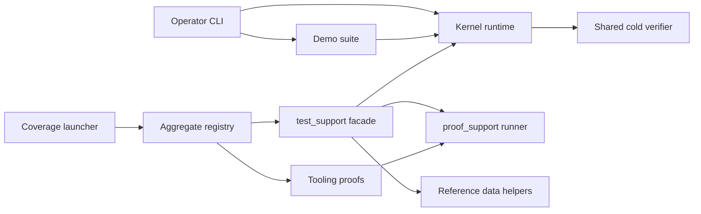

# Sigil Crucible

_Licensed under AGPLv3; see [license](../LICENSE/LICENSE_INDEX.md)._

Rose Sigil Systems (RSS) is the overall project. Sigil Crucible names RSS's
development mechanism: the instructions and tools used to build, test, measure
and review the kernel and related code. Its responsibility is external to the
kernel's runtime role, while the executable tools remain versioned alongside
the code they check. In conventional engineering language, it is a development
and verification toolchain. Existing scripts provide parts of that mechanism;
its consolidated responsibility map is a design candidate, not a new runtime
capability.

**The name and BUILD-03-A through BUILD-03-E constraints are human-selected.
The documentation/map candidate and both correction deltas received independent
PASS reviews. Classifications remain provisional; ROADMAP owns checkpoint state
and the remaining BUILD-03 decisions.**

This document owns Crucible's identity, responsibility contract and BUILD
document routes. [ROADMAP](../ROADMAP.md#current-build-thread) alone owns task
selection, state and disposition. [TESTING](TESTING.md) owns runnable commands,
effects and detailed execution evidence. [BUILD_DISCIPLINE](BUILD_DISCIPLINE.md)
owns review and promotion procedure. The [external terminology map](EXTERNAL_MAP.md#development-terminology)
translates the names without renaming code.

## Project context and map scope

This owner maps Sigil Crucible's development and proof responsibilities. The
[architecture reconciliation route](PROJECT_CONTROL_SURFACE.md#named-architecture-map-reconciliation)
coordinates the wider project and runtime views through their existing owners.
Use [canonical RSS terms](EXTERNAL_MAP.md#core-translation) and
[subsystem handles](SUBSYSTEM_HANDLES.md#canonical-handles) first, with familiar
engineering descriptions as explanations. Descriptive boxes in the development
diagram do not assign new component names.

The complete dated inventory accounts for its recorded Roots revision. It does
not establish project-wide coverage of every lane or future component. The
broader map must declare its inspected scope and unresolved boundaries. It does
not add a prerequisite to a separately selected, bounded BUILD-03 correction.

## BUILD document routes

All BUILD IDs are routed through this document to their existing owners.
Routing does not make every BUILD task part of Sigil Crucible: repository-lane
operations retain their promotion and lane owners, and the separate reusable
operating method remains with Taproot. These routes do not duplicate the queue,
change another item's state or move its files. Historical receipts keep their
original wording. Kernel findings remain with [Kernel Findings](KERNEL_FINDINGS.md).

| Subject | Document or evidence owner |
| --- | --- |
| Current BUILD selection and disposition | [ROADMAP](../ROADMAP.md#current-build-thread) |
| BUILD-01 coverage ownership and failure propagation | [TESTING](TESTING.md#build-01--coverage-ownership-and-failure-propagation) |
| BUILD-02 temporary-file lifecycle and recovery | [TESTING findings](TESTING.md#build-system-findings) |
| BUILD-03 responsibility and dependency mapping | [Five agreements](#build-03-agreements), [static map](#build-03-static-map) |
| BUILD-03 input-selection and execution remainder | [Retained proposal](TESTING.md#build-03-bounded-remainder-proposal), [commands and effects](TESTING.md#build-03-command-and-effect-inventory) |
| BUILD-04 archive/generated ownership | [TESTING](TESTING.md#build-04--archive-history-and-generated-ownership) |
| BUILD-05 promotion-readiness evidence | [TESTING](TESTING.md#build-05-script-evidence-findings), [coverage target](roadmap/COVERAGE_TRACKER.md#current-targets) |
| BUILD-06 promotion/reconciliation; BUILD-07 Lab refresh | [Promotion procedure](BUILD_DISCIPLINE.md#promotion-and-reconciliation-loop), [lane boundaries](BUILD_DISCIPLINE.md#three-trees-one-direction-of-trust) |
| BUILD-08 separate method handoff | [Method ownership](PROJECT_CONTROL_SURFACE.md#supporting-evidence-and-session-state) |
| Canonical acceptance, standalone suites and gate commands | [TESTING](TESTING.md#canonical-runner) |
| Complete dated file baseline | [Sigil Component Inventory](BUILD_COMPONENT_INVENTORY.md) |
| Original proof and checkpoint receipts | [Acceptance History](roadmap/ACCEPTANCE_HISTORY.md) |

## BUILD-03 agreements

These are five labeled acceptance conditions within BUILD-03, not five new
workstreams. ROADMAP records their current evidence state. All implementation
and promotion boundaries remain explicit.

### BUILD-03-A — Stable repository and proof contract

Keep one repository and the existing aggregate command
`python tests/test_all.py`. Preserve source paths, registration order, CLAIM tags,
the final verdict line and reported totals while mapping. Full reorganization
is postponed. A future change must reconcile every affected consumer before
moving files or altering proof reporting.

Review condition: compare source/registration bytes and all count-producing
surfaces against the candidate's baseline. A documentation-only map supplies
no new acceptance, assertion or coverage result.

### BUILD-03-B — Complete dated baseline

Retain the complete 123-path [file inventory](BUILD_COMPONENT_INVENTORY.md) as
the dated baseline, including its provisional and mixed labels. It remains
unchanged by this pass. Concentrate new analysis on mixed units rather than
replacing the inventory with inferred directory rules.

The baseline's ownership and untracked-candidate sentences are dated context.
This document now owns the responsibility rules; TESTING retains commands and
execution evidence. The baseline's one-candidate statement describes its earlier
scope, not the current working-tree inventory. Its earlier naming-only update
is retained and did not relabel the 123 tracked-path entries.

The only new repository file in the mapping pass was this owner, labeled
`documentation` with subject `Crucible responsibility and build routing`.
It is a candidate supplement, not an automatically staged input. An eventual
rules-and-exceptions view must demonstrate complete accounting before replacing
the baseline. Baseline labels describe the earlier draft; refinements below
do not silently rewrite it.

### BUILD-03-C — Role, proof subject, effects and authority

Record separately:

| Field | Meaning | Rule |
| --- | --- | --- |
| Role | What a unit does | Use the existing responsibility vocabulary; retain mixed roles when needed. |
| Proof subject | Which behavior a test checks | Classify per function; fixture imports alone do not determine the subject. |
| Effects | What it may read or change | Multiple labels may apply; record target and conditions. |
| Required authority | What permission the operation requires | A requirement is not evidence that it is authenticated or enforced. |
| Observed enforcement | What source checks or guards actually exist | Name the check and its limit; an absent or uninspected check stays explicit. |

Effect labels used below are `memory`, `console`, `process-state`,
`file-read`, `file-write`, `database-read`, `database-write`,
`network` and `child-process`. `unknown` is a limit, not a safe default.
"Owned temporary" describes an intended target, not enforced containment.
T-0 belongs in the authority field and may accompany several effects.

The role vocabulary remains `kernel`, `operator`, `tooling`, `test`,
`harness`, `example`, `specification`, `workflow`, `documentation`,
`generated` and `repository`. A shared verifier may serve kernel and operator
callers. A harness serves proofs; it does not itself acquire every proof's
subject. "Mixed" calls for inspection, not automatic splitting.

### BUILD-03-D — Registration by name

Resolve every canonical registry entry through its import binding to a unique
top-level definition. Compare qualified names both ways; check duplicates,
unresolved bindings and unregistered definitions. Preserve registry order.

The [registration reconciliation](#registration-reconciliation) establishes
static membership for this candidate. It does not establish that tests execute,
that assertions are sufficient, or that reported historical totals were rerun.

### BUILD-03-E — Dependencies before moves

Map imports, calls, data/output effects and consumers of paths before declaring
an edge defective or selecting a move. Operator-to-demo integration may be
intentional. Source location alone does not establish a runtime dependency.

A reviewed map precedes selecting one bounded implementation. Resolver/hygiene
input selection remains a candidate on its current paths; compatibility choices
in the [retained proposal](TESTING.md#build-03-bounded-remainder-proposal) remain
open. Naming is settled and need not delay a selected correctness repair.

## BUILD-03 static map

**Static map, started 2026-09-14; harness revalidated 2026-09-16.**
The original analysis at `f2ef219` parsed 64 tracked Python files with the
standard library and did not import project modules or execute proof bodies.
Function subjects and boundary interpretations remain provisional; direct source
relationships are distinguished from proposed placement.

The current harness rows, tooling-import edge, initialization and path consumers
below use the [proof-support candidate source hashes](#candidate-source-binding).
The combined-hygiene child-command anchor was revalidated for the 2026-09-15
input-selection candidate; its child-command list is unchanged. Other map anchors
and the preserved registration appendix retain their `f2ef219` binding. The
appendix is a dated baseline, including its pre-separation tooling line numbers.

The implementation and its independent static review reconciled all 181 names.
This documentation correction changes no source and reuses that reconciliation.
Revalidate affected current-map anchors after any referenced source changes.
Changes under `tests/`, including `tests/test_all.py`, also require fresh static
name reconciliation.

This pass covers command dispatch, the shared harness, registration, reference
data, measurement and consumers of paths. Audit services and demo helpers are
included where those edges lead. It is not a complete dynamic call graph,
security audit or assessment of every assertion.


### Overview of observed relationships



Arrows summarize inspected calls or imports. They do not establish isolation,
independent authority or permission to move components.

### Command and service responsibilities

The full invocation/effect inventory remains in
[TESTING](TESTING.md#build-03-command-and-effect-inventory). The following rows
add symbol/caller distinctions rather than replacing that command inventory.
Effects are conditional on the called route; CLI bootstrap effects accumulate
with command-specific effects.

Both tables below separate required authority from observed enforcement.
`Unassessed` means this pass did not establish the permission requirement; it
does not mean permission is unnecessary. The final column retains caller/context
facts and describes enforcement only where a specific check was inspected.

| Unit / source anchor | Role | Potential effects | Required authority | Observed enforcement / caller context |
| --- | --- | --- | --- | --- |
| [CLI dispatch / bootstrap](../src/main.py#L418) | operator | database-read, database-write, console | Unassessed. | Every dispatch bootstraps first. The restore set at line 424 includes operational/demo commands; default test and unknown commands use restore=False. A command name does not make startup read-only. |
| [run_tests](../src/main.py#L52) | operator + smoke proof | database-write, console | Unassessed. | Ten classification requests use use_llm=False. The CLI calls this function; it is not canonical acceptance. No command rename is selected. |
| [demo_scope_policy_for](../src/main.py#L94) | example | memory | Unassessed. | Called by run_demo to choose a demo scope policy; not an independent runtime authority. |
| [run_demo](../src/main.py#L110) | operator + example | database-write, console, network | Unassessed. | Loads reference data, accepts interactive input and calls the runtime. Network use follows the adapter path; startup itself was not exercised. |
| [run_demo_suite](../src/main.py#L138) | operator + example | process-state, database-write, file-write, console | Unassessed. | Adds repository root to sys.path and calls examples.demo_suite.build_demo_report(live_llm=False). Its demo database is separate from the already bootstrapped CLI runtime. |
| [show_status](../src/main.py#L152) | operator | database-read, console, network | Unassessed. | Inspects runtime state and calls llm.is_available(); add the dispatch bootstrap effects for CLI use. |
| [_print_t0_denial](../src/main.py#L179) | operator presentation | console | Unassessed. | Formats a runtime denial. It does not authenticate a caller. |
| [add_term](../src/main.py#L189), [add_synonym](../src/main.py#L260), [remove_synonym_cmd](../src/main.py#L300), [disallow_term](../src/main.py#L325) | operator | database-read, database-write, console | T-0 command intent for vocabulary mutation. | Pass an explicit --t0-command boolean to runtime methods and inspect denial results. This is the current soft T-0 seam, not caller authentication. |
| [add_entry](../src/main.py#L235) | operator | database-write, console | Unassessed. | Calls save_hub_entry; no separate --t0-command option is implemented here. Do not infer the vocabulary-command contract applies to every mutation. |
| [list_terms](../src/main.py#L348), [list_hub](../src/main.py#L369) | operator | memory, database-read, console | Unassessed. | Read supplied runtime objects. CLI use still includes bootstrap. |
| [export_trace](../src/main.py#L394) | operator | database-read, file-write, console | Unassessed. | Calls export_from_db with a caller-selected/default file; it is distinct from Pact canon export. |
| [restricted recovery clear](../src/main.py#L439), [normal clear-safe-stop](../src/main.py#L479) | operator | database-write, console | T-0 command intent for recovery. | Dispatch directly supplies t0_command=True for recovery. No authenticated principal is established by this static flag. |
| [verify_trace_file](../src/rss/audit/verify.py#L457), [read_safe_stop_state](../src/rss/audit/verify.py#L564) | shared service: kernel / operator | database-read | Unassessed. | The verifier uses _open_readonly at line 148. Runtime.verify_pre_emission_boot_chain imports verify_trace_file at runtime.py:618; read_safe_stop_state also serves operator/demo callers. |
| [verify._main](../src/rss/audit/verify.py#L653), [_format_human_report](../src/rss/audit/verify.py#L588) | operator | database-read, console | Unassessed. | CLI/report presentation over the reusable verifier; optional registry loading is an additional import path. Classifying the whole file as operator-only would miss its kernel caller. |
| [compare_pact_to_canon](../src/rss/audit/pact_canon_drift.py#L136), [drift._main](../src/rss/audit/pact_canon_drift.py#L194) | operator service / CLI | file-read, database-read, console for CLI | Unassessed. | Reads section files and latest sealed records; the SQLite URI uses mode=ro at line 99. An operator role does not imply writes. |
| [export_pact_canon](../src/rss/audit/pact_canon_export.py#L183), [canon_export._main](../src/rss/audit/pact_canon_export.py#L373) | operator service / CLI | file-read, database-read; conditional file-write | T-0 for write mode; separate scoped authorization for live Pact changes. Preview authority is unassessed. | write=False previews. Writing additionally checks the soft T-0 flag at line 310 and base/canon hashes, then calls _atomic_write_text at line 327. It can write Pact files when separately authorized; Crucible test fixtures do not grant live-Pact authority. |
| [cycle main guard](../src/rss/governance/seats/cycle.py#L142) | example within a kernel module | memory, console | Unassessed. | Incidental example code; preserve the Cycle runtime class and inspect entrypoint consumers before any extraction. |

### Harness and proof dependencies

The harness is shared infrastructure; proof subjects belong to individual test
functions. A direct module run and the aggregate do not have identical guard
settings. Current cleanup/error suppression remains a BUILD-02 concern, not a
repair performed by this map.

| Unit / source anchor | Role / subject | Potential effects | Required authority | Observed enforcement / caller context |
| --- | --- | --- | --- | --- |
| [Windows stream setup](../tests/proof_support.py#L39) | harness | process-state | Unassessed. | proof_support configures the streams before the facade imports kernel services. This setup has one owner. |
| [facade imports](../tests/test_support.py#L39), [kernel imports](../tests/test_support.py#L50), [reference data import](../tests/test_support.py#L79) | harness / kernel fixture facade | process-state | Unassessed. | test_support adds src to sys.path, re-exports the runner functions and imports kernel services plus reference_pack. The ten remaining wildcard consumers retain this import-time reach; the tooling module uses proof_support directly. |
| [_running_under_pytest](../tests/proof_support.py#L64), [check](../tests/proof_support.py#L75) | harness | memory, console; conditional exception | Unassessed. | Counter/report behavior plus pytest failure behavior. These are not proof bodies. |
| [section](../tests/proof_support.py#L87), [reset_counters](../tests/proof_support.py#L103) | harness | memory, console | Unassessed. | Formatting and aggregate counters. Resetting once per future group would change the aggregate contract. |
| [isolated_counters](../tests/proof_support.py#L53) | harness | memory | Unassessed. | Saves and restores the four owner counters around a nested proof scope; inner counts do not enter the outer aggregate. This is not thread isolation. |
| [safe_run](../tests/proof_support.py#L91) | harness | delegates proof effects, memory, console | Unassessed. | Calls the supplied proof and counts errors/functions; it is not a confinement boundary. |
| [deny_live_http](../tests/proof_support.py#L113) | harness | process-state | Unassessed. | Patches urllib.request.OpenerDirector.open and retains attempts. It does not cover every possible network API or impose OS isolation. |
| [run_tests](../tests/proof_support.py#L128) | harness | delegates proof effects, memory, console | Unassessed. | Resets counters, runs proofs, prints aggregate verdict and raises SystemExit on recorded failures/errors. forbid_http defaults false. |
| [module_tests](../tests/proof_support.py#L156), [run_module](../tests/proof_support.py#L164) | harness | reflection; delegates proof effects | Unassessed. | Collects test_-named callables and runs a direct module; no forbid_http=True is supplied here. |
| [_cleanup_db](../tests/test_support.py#L89) | harness / fixture lifecycle | file-write (deletion), process-state | Unassessed. | Deletes the supplied DB and sidecars with retries; final errors are swallowed. Ownership and refusal guarantees are not established by this helper. |
| [TESTS](../tests/test_all.py#L249), [run_all](../tests/test_all.py#L435) | harness | delegates all registered proof effects | Unassessed. | One aggregate registry; run_all supplies forbid_http=True. Membership is reconciled by qualified name below. |
| [explicit tooling imports](../tests/test_docs_tooling.py#L36) | test; subject tooling | process-state, temporary file-write through fixtures | Unassessed. | The proof bodies use check/section from proof_support and explicit standard-library imports. This module no longer imports test_support or kernel services. Aggregate acceptance still loads its other, kernel-dependent proof modules. |
| [_load_main_module](../tests/test_cli.py#L36), [demo/main loaders](../tests/test_demo_reference_pack.py#L49) | test helper | process-state; later fixture effects | Unassessed. | Loads source by filename with importlib. Static import edges alone would miss these paths. |

<details>
<summary>Per-module global names also exported by test_support</summary>

This is a retained static overlap list from the original map, not executed wildcard resolution. Explicit imports can shadow these names. The tooling row now points to its explicit imports; overlapping names do not establish a dependency on test_support.

| Proof module | Referenced overlapping names |
| --- | --- |
| [tests/test_action_plane.py](../tests/test_action_plane.py#L29) | `AuditLogError`, `EVENT_CODES`, `RSSConfig`, `UTC`, `_cleanup_db`, `bootstrap`, `check`, `contextmanager`, `datetime`, `nullcontext`, `os`, `run_module`, `section`, `tempfile`, `timedelta` |
| [tests/test_adversarial_scenarios.py](../tests/test_adversarial_scenarios.py#L32) | `AuditLogError`, `CONTENT_ONLY`, `HubError`, `HubTopology`, `LLMAdapter`, `MeaningLaw`, `PAVBuilder`, `RSSConfig`, `SafeStopRecovery`, `Scope`, `_cleanup_db`, `bootstrap`, `check`, `json`, `os`, `run_module`, `section`, `sqlite3`, `tempfile` |
| [tests/test_audit_pact_canon_export.py](../tests/test_audit_pact_canon_export.py#L33) | `check`, `compute_hash`, `section`, `sqlite3`, `tempfile` |
| [tests/test_audit_trace.py](../tests/test_audit_trace.py#L37) | `AuditLog`, `AuditLogError`, `EVENT_CODES`, `HubTopology`, `Persistence`, `REDLINE_REDACTED`, `RSSConfig`, `SafeStopRecovery`, `TraceEvent`, `TraceExportSanitizationError`, `UTC`, `_cleanup_db`, `_sanitize_artifact_id`, `bootstrap`, `build_event_summary`, `categorize_event`, `check`, `compute_hash`, `datetime`, `describe_migration_path`, `export_from_db`, `export_trace_json`, `export_trace_text`, `json`, `migration_required`, `os`, `run_module`, `section`, `sqlite3`, `tempfile` |
| [tests/test_cli.py](../tests/test_cli.py#L33) | `RSSConfig`, `bootstrap`, `check`, `os`, `section`, `tempfile` |
| [tests/test_core_runtime.py](../tests/test_core_runtime.py#L32) | `AuditLogError`, `CanonArtifact`, `ConstitutionConfig`, `ConstitutionError`, `ExecutionIntent`, `ExecutionStateMachine`, `LLMAdapter`, `Oath`, `Persistence`, `RSSConfig`, `Runtime`, `SafeStopRecovery`, `SafeStopTriggered`, `Seal`, `SealPacket`, `Term`, `UTC`, `Ward`, `WardError`, `_cleanup_db`, `bootstrap`, `check`, `compute_hash`, `datetime`, `deny_live_http`, `json`, `load_constitution`, `os`, `run_module`, `safe_stop`, `section`, `sqlite3`, `tempfile`, `timedelta`, `verify_integrity` |
| [tests/test_demo_reference_pack.py](../tests/test_demo_reference_pack.py#L38) | `DEMO_CONTAINERS`, `REFERENCE_PACK`, `RSSConfig`, `_cleanup_db`, `bootstrap`, `check`, `compute_hash`, `json`, `load_demo_containers`, `load_reference_pack`, `os`, `run_module`, `section`, `seed_demo_world`, `tempfile` |
| [tests/test_docs_tooling.py](../tests/test_docs_tooling.py#L36) | `check`, `os`, `section`, `sys`, `tempfile` |
| [tests/test_governance_seats.py](../tests/test_governance_seats.py#L32) | `CONTENT_ONLY`, `CanonArtifact`, `Cycle`, `ExecutionStateMachine`, `MeaningError`, `MeaningLaw`, `Oath`, `PAVBuilder`, `RSSConfig`, `Scope`, `Scribe`, `ScribeError`, `Seal`, `SealError`, `SealPacket`, `Term`, `UTC`, `Ward`, `WardError`, `_cleanup_db`, `bootstrap`, `check`, `datetime`, `os`, `run_module`, `section`, `tempfile`, `timedelta` |
| [tests/test_hubs_persistence.py](../tests/test_hubs_persistence.py#L32) | `CONTENT_ONLY`, `FULL_CONTEXT`, `HubEntry`, `HubError`, `HubTopology`, `PAVBuilder`, `PURGE_SENTINEL`, `Persistence`, `RSSConfig`, `SafeStopRecovery`, `Scope`, `ScopeError`, `Tecton`, `Term`, `TraceEvent`, `UTC`, `_cleanup_db`, `bootstrap`, `check`, `datetime`, `json`, `os`, `run_module`, `section`, `sqlite3`, `tempfile` |
| [tests/test_tenant_containers.py](../tests/test_tenant_containers.py#L32) | `ContainerPermissions`, `ContainerProfile`, `ContainerRequest`, `RSSConfig`, `SEAT_SIGILS`, `Tecton`, `TectonError`, `VALID_TRANSITIONS`, `_cleanup_db`, `bootstrap`, `check`, `os`, `run_module`, `section`, `sqlite3`, `tempfile` |

</details>

### Reference and demonstration functions

The tracked import scan finds reference_pack imports in the operator entrypoint,
demo suite, shared harness and demo proofs. No direct import of reference_pack
was found within `src/rss`. This is an observation about inspected imports,
not proof that dynamic or external consumers cannot exist.

| Unit / source anchor | Role | Potential effects | Callers / interpretation |
| --- | --- | --- | --- |
| [ReferencePackError](../src/rss/reference_pack.py#L40); [_reference_row](../src/rss/reference_pack.py#L234), _require_text, _require_list, _validate_hub, _validate_redline | example support / validation | memory; raises errors | Internal schema helpers used by the validators. The class names an error, not authority. |
| [validate_reference_pack](../src/rss/reference_pack.py#L266), [validate_demo_containers](../src/rss/reference_pack.py#L295) | example support / validation | memory | Called by their loaders and seed_demo_world, and explicitly by test_demo_reference_pack. Validation is not permission to write. |
| [iter_container_entries](../src/rss/reference_pack.py#L350) | example support / normalization | memory | Called by load_demo_containers and demo proof checks; supports current and legacy data shapes. |
| [load_reference_pack](../src/rss/reference_pack.py#L372) | example loader | database-read, database-write | Called by main.run_demo, seed_demo_world and demo proofs. Writes through rss.save_hub_entry, rather than a development-only store. |
| [_find_container_by_label](../src/rss/reference_pack.py#L386) | example lookup | memory / database-read through supplied runtime | Internal caller: load_demo_containers. |
| [load_demo_containers](../src/rss/reference_pack.py#L393) | example loader | database-read, database-write | Creates/activates/populates containers through rss.tecton. Called by seed_demo_world and demo proofs; do not claim every loader operation passes a common authenticated T-0 gate. |
| [seed_demo_world](../src/rss/reference_pack.py#L441) | example orchestration | database-read, database-write | Calls both validators and loaders. Demo caller: examples.demo_suite.build_demo_report at line 310; main imports the name but uses load_reference_pack in run_demo. |
| [build_demo_report](../examples/demo_suite.py#L239) | example + embedded verification | database-write, file-write; conditional network | Helper defaults offline and creates a temporary DB unless supplied one. Calls seed_demo_world, runtime operations, recovery and the cold verifier; optional artifacts write files. CLI _main instead defaults live_llm=True. |
| [write_demo_artifacts](../examples/demo_suite.py#L219) | example output | database-read, file-write | Writes report, summary and TRACE output. Intended artifact ownership is not host confinement. |
| [demo _cleanup_db](../examples/demo_suite.py#L133), [report finalization](../examples/demo_suite.py#L500) | example lifecycle | file-write (deletion) | Finalization closes the runtime and conditionally cleans an owned temporary DB. Existing suppressed errors and demo exit-status issues are retained, not repaired here. |

### Measurement boundaries

- [Coverage orchestration](../run_coverage.py#L66) runs the combined canonical
  suite with `--source=rss`. That is package line coverage under combined
  acceptance, not proof that only kernel-subject tests contributed.
- [Module counting](sync_baseline.py#L351) counts tracked non-marker Python
  modules below `src/rss`. The static inventory matches the inherited 26-module
  scope; the baseline tool was not executed.
- `reference_pack.py`, the audit CLI portions and the incidental Cycle example
  are within that package scope. The reusable audit verifier is also called by
  the runtime, so it must not be treated as wholly non-kernel merely because its
  file includes a CLI.
- [Coverage display labels](sync_baseline.py#L133) include reference_pack, drift
  and verify. Keep counting rules and public numbers unchanged pending an
  explicit reporting decision.
- [Verdict parsing](sync_baseline.py#L106) consumes the canonical final line.
  Standalone `docs/test_*.py` suites use different reporting units; do not add
  their unittest counts to the custom runner's assertion total.

The inherited acceptance/assertion/coverage figures remain inherited. Static
membership and package-file counts above do not remeasure execution or coverage.

### Dependency and path consumers

| Consumer / anchor | Dependency | Implication before a move |
| --- | --- | --- |
| [operator demo command](../src/main.py#L144) | examples.demo_suite | Operator-to-demo integration; no defect or move is selected solely from this edge. |
| [Runtime.verify_pre_emission_boot_chain](../src/rss/core/runtime.py#L618) | rss.audit.verify.verify_trace_file | Runtime-to-shared-verifier dependency. It refines the baseline whole-file operator label. |
| [canonical registry imports](../tests/test_all.py#L66) | test_docs_tooling | Four tooling proofs participate in aggregate acceptance. |
| [tooling proof module](../tests/test_docs_tooling.py#L36) | proof_support plus explicit standard-library imports | The direct tooling-to-test_support import and its kernel/reference import reach have been removed. The shared aggregate still runs both tooling and kernel proofs. |
| [claim selector](../docs/build_claim_matrix.py#L217) | tests/test_*.py at two path components | Nested test folders would drop their claim inputs under the current predicate. |
| [demo source-reading proof](../tests/test_adversarial_scenarios.py#L1118) | three fixed demo_llm.py candidates | Move planning must preserve or deliberately reconcile this source-text check. |
| [pytest path shim](../tests/conftest.py#L41), [direct-run path shim](../tests/test_support.py#L47) | sibling src directory | Pytest and direct invocation have distinct setup paths. Keep both in any future import migration. |
| [CLI source loader](../tests/test_cli.py#L38), [tool source loaders](../tests/test_docs_tooling.py#L39) | src/main.py and named docs/*.py paths | importlib loads by filesystem path; module import searches alone are incomplete. |
| [coverage launcher](../run_coverage.py#L66), [baseline orchestration](../docs/sync_baseline.py#L335) | tests/test_all.py / run_coverage.py | Both command paths and final-line semantics are compatibility surfaces. |
| [combined hygiene children](../docs/check_public_hygiene.py#L273) | baseline, contact surface, claim, reverse map, status, resolver | A helper classification does not make the combined wrapper a read-only fixture check. |
| [reverse-map scope](../docs/build_pact_code_map.py#L129), [module scope](../docs/sync_baseline.py#L353) | src/rss and Pact/source patterns | A move can change both traceability and reported scope without changing behavior. |
| [TESTING](TESTING.md), [BUILD_DISCIPLINE](BUILD_DISCIPLINE.md), [receipts](roadmap/ACCEPTANCE_HISTORY.md) | documented commands, links and historical paths | Current routes need reconciliation; historical receipt bytes remain preserved, not mass-renamed. |

The edges above justify targeted decisions, not a full reorganization. No
selected package/command rename follows from this map. No distribution manifest
was found among tracked paths; that fact alone does not establish that external
consumers are absent.

## Registration reconciliation

Static import-binding and definition reconciliation found **181 entries resolving
to 181 distinct top-level functions across 11 proof modules**, with no unresolved
bindings, duplicate registrations, duplicate definitions, omitted definitions or
registrations lacking a definition. Both sets were compared by qualified name,
not count alone. Registry order and source bytes remain unchanged.

The appendix records each name and both source anchors. Subject labels use
inspected APIs, function intent and selected bodies; they remain provisional.
A kernel fixture does not automatically make an operator/tooling test a kernel
proof. Conversely, a cold verifier used as an assertion helper does not
automatically change the test's primary subject. Mixed subjects remain visible.

<details>
<summary>Complete registration and provisional proof-subject map</summary>

| Order / registry anchor | Qualified definition | Provisional subject |
| --- | --- | --- |
| [1](../tests/test_all.py#L250) | [test_core_runtime.py:test_constitution](../tests/test_core_runtime.py#L35) | kernel |
| [2](../tests/test_all.py#L251) | [test_core_runtime.py:test_constitution_load_constitution](../tests/test_core_runtime.py#L59) | kernel |
| [3](../tests/test_all.py#L252) | [test_audit_trace.py:test_audit_log](../tests/test_audit_trace.py#L52) | kernel |
| [4](../tests/test_all.py#L253) | [test_audit_trace.py:test_pact_canon_drift_detector_no_canon](../tests/test_audit_trace.py#L142) | operator |
| [5](../tests/test_all.py#L254) | [test_audit_trace.py:test_pact_canon_drift_detector_compares_latest_records](../tests/test_audit_trace.py#L163) | operator |
| [6](../tests/test_all.py#L255) | [test_audit_trace.py:test_pact_canon_drift_detector_helpers_and_db_edges](../tests/test_audit_trace.py#L221) | operator |
| [7](../tests/test_all.py#L256) | [test_audit_trace.py:test_pact_canon_drift_detector_cli_outputs](../tests/test_audit_trace.py#L297) | operator |
| [8](../tests/test_all.py#L257) | [test_governance_seats.py:test_ward](../tests/test_governance_seats.py#L35) | kernel |
| [9](../tests/test_all.py#L258) | [test_governance_seats.py:test_scope](../tests/test_governance_seats.py#L166) | kernel |
| [10](../tests/test_all.py#L259) | [test_hubs_persistence.py:test_hubs](../tests/test_hubs_persistence.py#L35) | kernel |
| [11](../tests/test_all.py#L260) | [test_hubs_persistence.py:test_pav](../tests/test_hubs_persistence.py#L62) | kernel |
| [12](../tests/test_all.py#L261) | [test_hubs_persistence.py:test_pav_skipped_source_visibility](../tests/test_hubs_persistence.py#L85) | kernel |
| [13](../tests/test_all.py#L262) | [test_governance_seats.py:test_meaning_law](../tests/test_governance_seats.py#L193) | kernel |
| [14](../tests/test_all.py#L263) | [test_core_runtime.py:test_state_machine](../tests/test_core_runtime.py#L145) | kernel |
| [15](../tests/test_all.py#L264) | [test_governance_seats.py:test_execution_word_boundary_hardening](../tests/test_governance_seats.py#L241) | kernel |
| [16](../tests/test_all.py#L265) | [test_governance_seats.py:test_scribe](../tests/test_governance_seats.py#L267) | kernel |
| [17](../tests/test_all.py#L266) | [test_governance_seats.py:test_scribe_extended_edges](../tests/test_governance_seats.py#L289) | kernel |
| [18](../tests/test_all.py#L267) | [test_governance_seats.py:test_seal](../tests/test_governance_seats.py#L373) | kernel |
| [19](../tests/test_all.py#L268) | [test_governance_seats.py:test_oath](../tests/test_governance_seats.py#L398) | kernel |
| [20](../tests/test_all.py#L269) | [test_governance_seats.py:test_oath_denied_consent_survives_restart](../tests/test_governance_seats.py#L542) | kernel |
| [21](../tests/test_all.py#L270) | [test_governance_seats.py:test_cycle](../tests/test_governance_seats.py#L612) | kernel |
| [22](../tests/test_all.py#L271) | [test_governance_seats.py:test_cycle_extended_edges](../tests/test_governance_seats.py#L626) | kernel |
| [23](../tests/test_all.py#L272) | [test_governance_seats.py:test_cycle_per_domain_load_metrics](../tests/test_governance_seats.py#L660) | kernel |
| [24](../tests/test_all.py#L273) | [test_hubs_persistence.py:test_persistence](../tests/test_hubs_persistence.py#L152) | kernel |
| [25](../tests/test_all.py#L274) | [test_hubs_persistence.py:test_persistence_roundtrip](../tests/test_hubs_persistence.py#L184) | kernel |
| [26](../tests/test_all.py#L275) | [test_hubs_persistence.py:test_restore_skipped_records_are_visible](../tests/test_hubs_persistence.py#L246) | kernel |
| [27](../tests/test_all.py#L276) | [test_hubs_persistence.py:test_s0_8_4_governed_state_bootstrap_roundtrip](../tests/test_hubs_persistence.py#L324) | kernel |
| [28](../tests/test_all.py#L277) | [test_governance_seats.py:test_vocabulary_management](../tests/test_governance_seats.py#L680) | kernel |
| [29](../tests/test_all.py#L278) | [test_audit_trace.py:test_trace_export](../tests/test_audit_trace.py#L91) | kernel |
| [30](../tests/test_all.py#L279) | [test_audit_trace.py:test_safe_stop_persistent](../tests/test_audit_trace.py#L323) | kernel |
| [31](../tests/test_all.py#L280) | [test_core_runtime.py:test_genesis_blocking](../tests/test_core_runtime.py#L189) | kernel |
| [32](../tests/test_all.py#L281) | [test_core_runtime.py:test_bootstrap_requires_genesis_before_authority](../tests/test_core_runtime.py#L253) | kernel |
| [33](../tests/test_all.py#L282) | [test_core_runtime.py:test_bootstrap_refuses_invalid_critical_consent](../tests/test_core_runtime.py#L409) | kernel |
| [34](../tests/test_all.py#L283) | [test_core_runtime.py:test_default_genesis_binding_live_verify_and_recovery](../tests/test_core_runtime.py#L752) | kernel |
| [35](../tests/test_all.py#L284) | [test_core_runtime.py:test_llm](../tests/test_core_runtime.py#L828) | kernel |
| [36](../tests/test_all.py#L285) | [test_core_runtime.py:test_runtime](../tests/test_core_runtime.py#L980) | kernel |
| [37](../tests/test_all.py#L286) | [test_tenant_containers.py:test_tecton](../tests/test_tenant_containers.py#L35) | kernel |
| [38](../tests/test_all.py#L287) | [test_audit_trace.py:test_trace_seat](../tests/test_audit_trace.py#L390) | kernel |
| [39](../tests/test_all.py#L288) | [test_core_runtime.py:test_pre_seal_drift_check](../tests/test_core_runtime.py#L1052) | kernel |
| [40](../tests/test_all.py#L289) | [test_core_runtime.py:test_write_ahead_guarantee](../tests/test_core_runtime.py#L1113) | kernel |
| [41](../tests/test_all.py#L290) | [test_core_runtime.py:test_safe_stop_clear_atomicity](../tests/test_core_runtime.py#L1994) | kernel |
| [42](../tests/test_all.py#L291) | [test_core_runtime.py:test_safe_stop_recovery_surface](../tests/test_core_runtime.py#L2328) | kernel |
| [43](../tests/test_all.py#L292) | [test_governance_seats.py:test_word_boundary](../tests/test_governance_seats.py#L752) | kernel |
| [44](../tests/test_all.py#L293) | [test_governance_seats.py:test_classification_order](../tests/test_governance_seats.py#L791) | kernel |
| [45](../tests/test_all.py#L294) | [test_governance_seats.py:test_anti_trojan](../tests/test_governance_seats.py#L814) | kernel |
| [46](../tests/test_all.py#L295) | [test_governance_seats.py:test_anti_trojan_runtime](../tests/test_governance_seats.py#L872) | kernel |
| [47](../tests/test_all.py#L296) | [test_governance_seats.py:test_synonym_removal](../tests/test_governance_seats.py#L929) | kernel |
| [48](../tests/test_all.py#L297) | [test_governance_seats.py:test_compound_detection](../tests/test_governance_seats.py#L982) | kernel |
| [49](../tests/test_all.py#L298) | [test_governance_seats.py:test_contextual_reinjection](../tests/test_governance_seats.py#L1027) | kernel |
| [50](../tests/test_all.py#L299) | [test_governance_seats.py:test_redline_suppression](../tests/test_governance_seats.py#L1090) | kernel |
| [51](../tests/test_all.py#L300) | [test_core_runtime.py:test_config_driven_verbs](../tests/test_core_runtime.py#L2634) | kernel |
| [52](../tests/test_all.py#L301) | [test_core_runtime.py:test_pipeline_stage_tracking](../tests/test_core_runtime.py#L2688) | kernel |
| [53](../tests/test_all.py#L302) | [test_core_runtime.py:test_safe_stop_inflight](../tests/test_core_runtime.py#L2743) | kernel |
| [54](../tests/test_all.py#L303) | [test_audit_trace.py:test_event_code_taxonomy](../tests/test_audit_trace.py#L433) | kernel |
| [55](../tests/test_all.py#L304) | [test_core_runtime.py:test_configurable_llm_timeout](../tests/test_core_runtime.py#L2792) | kernel |
| [56](../tests/test_all.py#L305) | [test_core_runtime.py:test_llm_response_validation](../tests/test_core_runtime.py#L2816) | kernel |
| [57](../tests/test_all.py#L306) | [test_governance_seats.py:test_seal_review_attestation](../tests/test_governance_seats.py#L1146) | kernel |
| [58](../tests/test_all.py#L307) | [test_core_runtime.py:test_ward_hook_enforcement](../tests/test_core_runtime.py#L2890) | kernel |
| [59](../tests/test_all.py#L308) | [test_hubs_persistence.py:test_s4_personal_scope_guard](../tests/test_hubs_persistence.py#L459) | kernel |
| [60](../tests/test_all.py#L309) | [test_hubs_persistence.py:test_s4_scope_immutability](../tests/test_hubs_persistence.py#L486) | kernel |
| [61](../tests/test_all.py#L310) | [test_hubs_persistence.py:test_s4_scope_hub_validation](../tests/test_hubs_persistence.py#L513) | kernel |
| [62](../tests/test_all.py#L311) | [test_hubs_persistence.py:test_s4_scope_container_id](../tests/test_hubs_persistence.py#L539) | kernel |
| [63](../tests/test_all.py#L312) | [test_hubs_persistence.py:test_s4_archival_original_hub](../tests/test_hubs_persistence.py#L556) | kernel |
| [64](../tests/test_all.py#L313) | [test_hubs_persistence.py:test_s4_hard_purge](../tests/test_hubs_persistence.py#L583) | kernel |
| [65](../tests/test_all.py#L314) | [test_hubs_persistence.py:test_s4_governed_search](../tests/test_hubs_persistence.py#L649) | kernel |
| [66](../tests/test_all.py#L315) | [test_hubs_persistence.py:test_s4_ledger_pav_exclusion](../tests/test_hubs_persistence.py#L682) | kernel |
| [67](../tests/test_all.py#L316) | [test_hubs_persistence.py:test_s4_redline_declassification](../tests/test_hubs_persistence.py#L707) | kernel |
| [68](../tests/test_all.py#L317) | [test_hubs_persistence.py:test_s4_pav_hub_audit](../tests/test_hubs_persistence.py#L758) | kernel |
| [69](../tests/test_all.py#L318) | [test_hubs_persistence.py:test_s4_persistence_roundtrip](../tests/test_hubs_persistence.py#L782) | kernel |
| [70](../tests/test_all.py#L319) | [test_hubs_persistence.py:test_s4_hub_provenance](../tests/test_hubs_persistence.py#L822) | kernel |
| [71](../tests/test_all.py#L320) | [test_hubs_persistence.py:test_s4_provenance_persistence](../tests/test_hubs_persistence.py#L866) | kernel |
| [72](../tests/test_all.py#L321) | [test_hubs_persistence.py:test_s4_pipeline_integration](../tests/test_hubs_persistence.py#L903) | kernel |
| [73](../tests/test_all.py#L322) | [test_tenant_containers.py:test_s5_sigil_alignment](../tests/test_tenant_containers.py#L97) | kernel |
| [74](../tests/test_all.py#L323) | [test_tenant_containers.py:test_s5_lifecycle_transitions](../tests/test_tenant_containers.py#L121) | kernel |
| [75](../tests/test_all.py#L324) | [test_tenant_containers.py:test_s5_destroyed_inaccessibility](../tests/test_tenant_containers.py#L178) | kernel |
| [76](../tests/test_all.py#L325) | [test_tenant_containers.py:test_s5_profile_immutability](../tests/test_tenant_containers.py#L246) | kernel |
| [77](../tests/test_all.py#L326) | [test_tenant_containers.py:test_s5_trace_filtering](../tests/test_tenant_containers.py#L297) | kernel |
| [78](../tests/test_all.py#L327) | [test_tenant_containers.py:test_s5_lifecycle_logging](../tests/test_tenant_containers.py#L352) | kernel |
| [79](../tests/test_all.py#L328) | [test_tenant_containers.py:test_s5_lifecycle_provenance](../tests/test_tenant_containers.py#L378) | kernel |
| [80](../tests/test_all.py#L329) | [test_tenant_containers.py:test_s5_scope_policy_tuples](../tests/test_tenant_containers.py#L408) | kernel |
| [81](../tests/test_all.py#L330) | [test_tenant_containers.py:test_s5_can_call_advisors](../tests/test_tenant_containers.py#L433) | kernel |
| [82](../tests/test_all.py#L331) | [test_tenant_containers.py:test_s5_container_persistence](../tests/test_tenant_containers.py#L470) | kernel |
| [83](../tests/test_all.py#L332) | [test_tenant_containers.py:test_s5_restored_active_profile_remains_immutable](../tests/test_tenant_containers.py#L528) | kernel |
| [84](../tests/test_all.py#L333) | [test_tenant_containers.py:test_s5_container_isolation](../tests/test_tenant_containers.py#L580) | kernel |
| [85](../tests/test_all.py#L334) | [test_tenant_containers.py:test_s5_s4_rules_in_containers](../tests/test_tenant_containers.py#L636) | kernel |
| [86](../tests/test_all.py#L335) | [test_tenant_containers.py:test_s5_valid_transitions_table](../tests/test_tenant_containers.py#L683) | kernel |
| [87](../tests/test_all.py#L336) | [test_tenant_containers.py:test_s5_consent_scoping](../tests/test_tenant_containers.py#L704) | kernel |
| [88](../tests/test_all.py#L337) | [test_hubs_persistence.py:test_f2_entry_id_stability](../tests/test_hubs_persistence.py#L971) | kernel |
| [89](../tests/test_all.py#L338) | [test_hubs_persistence.py:test_f2_container_entry_id_stability](../tests/test_hubs_persistence.py#L1019) | kernel |
| [90](../tests/test_all.py#L339) | [test_audit_trace.py:test_f4_event_code_registry](../tests/test_audit_trace.py#L474) | kernel |
| [91](../tests/test_all.py#L340) | [test_audit_trace.py:test_f4_event_categorization](../tests/test_audit_trace.py#L512) | kernel |
| [92](../tests/test_all.py#L341) | [test_audit_trace.py:test_f4_export_includes_summary](../tests/test_audit_trace.py#L556) | kernel |
| [93](../tests/test_all.py#L342) | [test_audit_trace.py:test_s6_schema_version_tracking](../tests/test_audit_trace.py#L594) | kernel |
| [94](../tests/test_all.py#L343) | [test_audit_trace.py:test_s6_schema_migrated_event](../tests/test_audit_trace.py#L643) | kernel |
| [95](../tests/test_all.py#L344) | [test_audit_trace.py:test_s6_chain_hash_migration_scaffold](../tests/test_audit_trace.py#L704) | kernel |
| [96](../tests/test_all.py#L345) | [test_audit_trace.py:test_s6_boot_chain_verification](../tests/test_audit_trace.py#L724) | kernel |
| [97](../tests/test_all.py#L346) | [test_audit_trace.py:test_s6_boot_chain_detects_tampering](../tests/test_audit_trace.py#L758) | kernel |
| [98](../tests/test_all.py#L347) | [test_audit_trace.py:test_s6_event_codes_registered](../tests/test_audit_trace.py#L795) | kernel |
| [99](../tests/test_all.py#L348) | [test_audit_trace.py:test_s6_bootstrap_event_sequence](../tests/test_audit_trace.py#L820) | kernel |
| [100](../tests/test_all.py#L349) | [test_audit_trace.py:test_s6_cold_verifier](../tests/test_audit_trace.py#L857) | kernel + operator |
| [101](../tests/test_all.py#L350) | [test_audit_trace.py:test_a1_historical_trace_chain_loaded_on_restart](../tests/test_audit_trace.py#L1258) | kernel |
| [102](../tests/test_all.py#L351) | [test_audit_trace.py:test_a1_restore_false_boot_continues_persisted_trace_chain](../tests/test_audit_trace.py#L1310) | kernel |
| [103](../tests/test_all.py#L352) | [test_audit_trace.py:test_a1_boot_verification_catches_persisted_tamper](../tests/test_audit_trace.py#L1349) | kernel |
| [104](../tests/test_all.py#L353) | [test_audit_trace.py:test_a1_unified_container_filter](../tests/test_audit_trace.py#L1417) | kernel + operator |
| [105](../tests/test_all.py#L354) | [test_audit_trace.py:test_a1_export_from_db_emits_chain_valid](../tests/test_audit_trace.py#L1529) | kernel |
| [106](../tests/test_all.py#L355) | [test_hubs_persistence.py:test_a1_consent_persistence_roundtrip](../tests/test_hubs_persistence.py#L1058) | kernel |
| [107](../tests/test_all.py#L356) | [test_audit_trace.py:test_a1_ttl_enforcement_in_stage_4](../tests/test_audit_trace.py#L1577) | kernel |
| [108](../tests/test_all.py#L357) | [test_audit_trace.py:test_a1_post_llm_scan_covers_archive_and_ledger](../tests/test_audit_trace.py#L1623) | kernel |
| [109](../tests/test_all.py#L358) | [test_adversarial_scenarios.py:test_c_phase_regression_battery](../tests/test_adversarial_scenarios.py#L1191) | kernel |
| [110](../tests/test_all.py#L359) | [test_tenant_containers.py:test_phase_d_regression_battery](../tests/test_tenant_containers.py#L850) | kernel |
| [111](../tests/test_all.py#L360) | [test_adversarial_scenarios.py:test_phase_e_regression_battery](../tests/test_adversarial_scenarios.py#L1073) | kernel + demonstration |
| [112](../tests/test_all.py#L361) | [test_tenant_containers.py:test_phase_e5_contextvar_isolation](../tests/test_tenant_containers.py#L751) | kernel |
| [113](../tests/test_all.py#L362) | [test_adversarial_scenarios.py:test_adversarial_ingress](../tests/test_adversarial_scenarios.py#L35) | kernel |
| [114](../tests/test_all.py#L363) | [test_adversarial_scenarios.py:test_adversarial_cross_container](../tests/test_adversarial_scenarios.py#L100) | kernel |
| [115](../tests/test_all.py#L364) | [test_adversarial_scenarios.py:test_adversarial_scope_escalation](../tests/test_adversarial_scenarios.py#L189) | kernel |
| [116](../tests/test_all.py#L365) | [test_adversarial_scenarios.py:test_adversarial_audit_tamper](../tests/test_adversarial_scenarios.py#L269) | kernel |
| [117](../tests/test_all.py#L366) | [test_adversarial_scenarios.py:test_adversarial_malformed_inputs](../tests/test_adversarial_scenarios.py#L329) | kernel |
| [118](../tests/test_all.py#L367) | [test_adversarial_scenarios.py:test_adversarial_policy_confusion](../tests/test_adversarial_scenarios.py#L390) | kernel |
| [119](../tests/test_all.py#L368) | [test_adversarial_scenarios.py:test_domain_pack_equivalence](../tests/test_adversarial_scenarios.py#L453) | kernel |
| [120](../tests/test_all.py#L369) | [test_adversarial_scenarios.py:test_exception_context_leak](../tests/test_adversarial_scenarios.py#L533) | kernel |
| [121](../tests/test_all.py#L370) | [test_adversarial_scenarios.py:test_idempotence_replay](../tests/test_adversarial_scenarios.py#L592) | kernel |
| [122](../tests/test_all.py#L371) | [test_adversarial_scenarios.py:test_instructional_override](../tests/test_adversarial_scenarios.py#L664) | kernel |
| [123](../tests/test_all.py#L372) | [test_adversarial_scenarios.py:test_scenario_high_liability_flow](../tests/test_adversarial_scenarios.py#L924) | kernel |
| [124](../tests/test_all.py#L373) | [test_adversarial_scenarios.py:test_scenario_tamper_recovery](../tests/test_adversarial_scenarios.py#L984) | kernel |
| [125](../tests/test_all.py#L374) | [test_governance_seats.py:test_s7_amendment_ceremony](../tests/test_governance_seats.py#L1164) | kernel |
| [126](../tests/test_all.py#L375) | [test_audit_trace.py:test_probe_chain_catches_duplicate_content_tamper](../tests/test_audit_trace.py#L1668) | kernel |
| [127](../tests/test_all.py#L376) | [test_adversarial_scenarios.py:test_probe_redline_not_leaked_via_search_surfaces](../tests/test_adversarial_scenarios.py#L1358) | kernel |
| [128](../tests/test_all.py#L377) | [test_adversarial_scenarios.py:test_probe_rune_resists_normalization_bypass](../tests/test_adversarial_scenarios.py#L1411) | kernel |
| [129](../tests/test_all.py#L378) | [test_adversarial_scenarios.py:test_probe_pav_still_excludes_redline_via_list_hub](../tests/test_adversarial_scenarios.py#L1466) | kernel |
| [130](../tests/test_all.py#L379) | [test_adversarial_scenarios.py:test_probe_indirect_prompt_injection_stays_data_not_authority](../tests/test_adversarial_scenarios.py#L741) | kernel |
| [131](../tests/test_all.py#L380) | [test_adversarial_scenarios.py:test_probe_untrusted_import_hash_binding](../tests/test_adversarial_scenarios.py#L843) | kernel |
| [132](../tests/test_all.py#L381) | [test_audit_trace.py:test_probe_hash_envelope_version_marker_present](../tests/test_audit_trace.py#L1716) | kernel |
| [133](../tests/test_all.py#L382) | [test_audit_trace.py:test_v2_runtime_cold_verifier_hash_parity](../tests/test_audit_trace.py#L1741) | kernel + operator |
| [134](../tests/test_all.py#L383) | [test_audit_trace.py:test_probe_container_filter_prefix_boundary](../tests/test_audit_trace.py#L1800) | kernel |
| [135](../tests/test_all.py#L384) | [test_audit_trace.py:test_probe_safe_stop_recovery_ceremony](../tests/test_audit_trace.py#L1878) | kernel + operator |
| [136](../tests/test_all.py#L385) | [test_governance_seats.py:test_oath_extended_edges](../tests/test_governance_seats.py#L1298) | kernel |
| [137](../tests/test_all.py#L386) | [test_governance_seats.py:test_oath_input_normalization_and_handle_edges](../tests/test_governance_seats.py#L1343) | kernel |
| [138](../tests/test_all.py#L387) | [test_governance_seats.py:test_oath_additional_proof](../tests/test_governance_seats.py#L1401) | kernel |
| [139](../tests/test_all.py#L388) | [test_core_runtime.py:test_runtime_default_term_pack_is_config_driven](../tests/test_core_runtime.py#L3006) | kernel |
| [140](../tests/test_all.py#L389) | [test_audit_trace.py:test_trace_export_cold_container_redline_sanitization](../tests/test_audit_trace.py#L2012) | kernel |
| [141](../tests/test_all.py#L390) | [test_audit_trace.py:test_trace_export_extended_edges](../tests/test_audit_trace.py#L2078) | kernel |
| [142](../tests/test_all.py#L391) | [test_audit_trace.py:test_trace_export_sanitizer_failure_fails_closed](../tests/test_audit_trace.py#L2123) | kernel |
| [143](../tests/test_all.py#L392) | [test_audit_trace.py:test_trace_export_token_boundary_sanitization](../tests/test_audit_trace.py#L2165) | kernel |
| [144](../tests/test_all.py#L393) | [test_audit_trace.py:test_trace_verify_cli_error_classification](../tests/test_audit_trace.py#L2186) | operator |
| [145](../tests/test_all.py#L394) | [test_audit_trace.py:test_trace_verify_registry_load_failure_is_nonfatal](../tests/test_audit_trace.py#L2212) | operator |
| [146](../tests/test_all.py#L395) | [test_governance_seats.py:test_seal_extended_edges](../tests/test_governance_seats.py#L1503) | kernel |
| [147](../tests/test_all.py#L396) | [test_audit_trace.py:test_trace_verify_additional_proof](../tests/test_audit_trace.py#L2243) | kernel + operator |
| [148](../tests/test_all.py#L397) | [test_audit_trace.py:test_trace_verify_human_report_branches](../tests/test_audit_trace.py#L2296) | kernel + operator |
| [149](../tests/test_all.py#L398) | [test_audit_trace.py:test_trace_chain_survives_concurrent_governed_writes](../tests/test_audit_trace.py#L2393) | kernel |
| [150](../tests/test_all.py#L399) | [test_audit_trace.py:test_trace_export_additional_proof](../tests/test_audit_trace.py#L2445) | kernel |
| [151](../tests/test_all.py#L400) | [test_audit_trace.py:test_v2_envelope_recomputation_detects_metadata_tamper](../tests/test_audit_trace.py#L2517) | kernel |
| [152](../tests/test_all.py#L401) | [test_audit_trace.py:test_v2_mixed_chain_migration_and_roundtrip](../tests/test_audit_trace.py#L2579) | kernel |
| [153](../tests/test_all.py#L402) | [test_audit_trace.py:test_ratified_amendment_atomicity](../tests/test_audit_trace.py#L2678) | kernel |
| [154](../tests/test_all.py#L403) | [test_audit_pact_canon_export.py:test_pact_canon_export_dry_run_refuses_unsafe_paths](../tests/test_audit_pact_canon_export.py#L162) | operator |
| [155](../tests/test_all.py#L404) | [test_audit_pact_canon_export.py:test_pact_canon_export_write_requires_t0_and_syncs_drift](../tests/test_audit_pact_canon_export.py#L188) | operator |
| [156](../tests/test_all.py#L405) | [test_audit_pact_canon_export.py:test_pact_canon_export_first_canon_requires_explicit_base_hash](../tests/test_audit_pact_canon_export.py#L211) | operator |
| [157](../tests/test_all.py#L406) | [test_audit_pact_canon_export.py:test_pact_canon_export_cli_defaults_to_dry_run](../tests/test_audit_pact_canon_export.py#L234) | operator |
| [158](../tests/test_all.py#L407) | [test_action_plane.py:test_action_plane_proposal_binding](../tests/test_action_plane.py#L70) | kernel |
| [159](../tests/test_all.py#L408) | [test_action_plane.py:test_action_plane_broker_gates](../tests/test_action_plane.py#L116) | kernel |
| [160](../tests/test_all.py#L409) | [test_action_plane.py:test_action_plane_result_import_and_replay](../tests/test_action_plane.py#L257) | kernel |
| [161](../tests/test_all.py#L410) | [test_action_plane.py:test_action_plane_capability_lease](../tests/test_action_plane.py#L332) | kernel |
| [162](../tests/test_all.py#L411) | [test_action_plane.py:test_action_plane_claim_revalidation](../tests/test_action_plane.py#L400) | kernel |
| [163](../tests/test_all.py#L412) | [test_action_plane.py:test_action_plane_claim_lifecycle](../tests/test_action_plane.py#L563) | kernel |
| [164](../tests/test_all.py#L413) | [test_action_plane.py:test_action_plane_event_codes_registered](../tests/test_action_plane.py#L779) | kernel |
| [165](../tests/test_all.py#L414) | [test_governance_seats.py:test_seal_ceremony_additional_proof](../tests/test_governance_seats.py#L1593) | kernel |
| [166](../tests/test_all.py#L415) | [test_governance_seats.py:test_s7_amendment_persistence_roundtrip](../tests/test_governance_seats.py#L1703) | kernel |
| [167](../tests/test_all.py#L416) | [test_demo_reference_pack.py:test_genesis_binding_and_offline_fallback](../tests/test_demo_reference_pack.py#L79) | kernel + demonstration |
| [168](../tests/test_all.py#L417) | [test_demo_reference_pack.py:test_demo_world_seed_and_container_isolation](../tests/test_demo_reference_pack.py#L129) | kernel + demonstration |
| [169](../tests/test_all.py#L418) | [test_demo_reference_pack.py:test_phase_g_demo_suite_operator_flow](../tests/test_demo_reference_pack.py#L337) | kernel + operator + demonstration |
| [170](../tests/test_all.py#L419) | [test_tenant_containers.py:test_tecton_destructive_transitions_require_reason](../tests/test_tenant_containers.py#L1010) | kernel |
| [171](../tests/test_all.py#L420) | [test_tenant_containers.py:test_tecton_rate_limit_validation_and_restore_sanitize](../tests/test_tenant_containers.py#L1083) | kernel |
| [172](../tests/test_all.py#L421) | [test_core_runtime.py:test_clear_safe_stop_idempotence](../tests/test_core_runtime.py#L3040) | kernel |
| [173](../tests/test_all.py#L422) | [test_core_runtime.py:test_t0_authorization_seam](../tests/test_core_runtime.py#L3084) | kernel |
| [174](../tests/test_all.py#L423) | [test_cli.py:test_cli_smoke_tests_treat_ambiguous_as_expected_classification](../tests/test_cli.py#L51) | kernel + operator |
| [175](../tests/test_all.py#L424) | [test_cli.py:test_cli_vocabulary_commands_require_t0_command](../tests/test_cli.py#L71) | kernel + operator |
| [176](../tests/test_all.py#L425) | [test_docs_tooling.py:test_reverse_pact_code_map_generator_parses_pact_heading_variants](../tests/test_docs_tooling.py#L54) | tooling |
| [177](../tests/test_all.py#L426) | [test_docs_tooling.py:test_project_status_generator_renders_bounded_public_status_view](../tests/test_docs_tooling.py#L118) | tooling |
| [178](../tests/test_all.py#L427) | [test_docs_tooling.py:test_orphan_number_guard_flags_unrecognized_stale_counts](../tests/test_docs_tooling.py#L227) | tooling |
| [179](../tests/test_all.py#L428) | [test_docs_tooling.py:test_claim_fidelity_floor_catches_vacuous_and_unanchored_claims](../tests/test_docs_tooling.py#L275) | tooling |
| [180](../tests/test_all.py#L429) | [test_core_runtime.py:test_llm_availability_timeout_is_config_driven](../tests/test_core_runtime.py#L3202) | kernel |
| [181](../tests/test_all.py#L430) | [test_hubs_persistence.py:test_archive_entry_returns_hub_entry](../tests/test_hubs_persistence.py#L1112) | kernel |

</details>

## Review boundary and remaining decisions

Review the five agreements against the map and the source anchors before choosing
a code slice. Check every proposed subject reassignment at a mixed interface.
Fixed review anchors include the CLI dispatch, runtime-to-verifier import,
tooling import boundary, claim-selector predicate, one registry entry from
each proof module, and the demo source-text dependency. Sampling anchors does
not replace the complete name reconciliation.

The retained resolver/hygiene proposal still requires decisions on explicit
Pact roots, untracked entrypoint refusal and preservation of historical wording.
Host Git discovery/configuration, output ownership, interruption/resource bounds
and launcher limitations remain distinct open execution-boundary issues.

Sigil Crucible has no independent runtime authority. Its tests may exercise
kernel behavior in explicitly owned fixtures under the relevant scope. Current
helpers, labels, a folder, a venv or successful checks do not establish host
confinement. Continuing within the existing environment does not by itself
accept every residual risk or close BUILD-03.

This map changes no code, tests, generated proof views or historical receipts.
Full gates, Main integration, publication, SITE work, BUILD-02 cleanup, BUILD-05
acceptance and kernel changes remain outside this candidate. The complete
baseline remains retained; the new owner is its explicit candidate supplement.

## BUILD-03 identity upkeep — standalone input proofs

**Documentation supplement, 2026-09-15.** Independent static review returned
PASS for the input candidate, identity supplement and N1/N2 correction; the
correction review reported no findings. The 41-test runs under both TEMP
spellings remain builder evidence, not independent execution. This applies
BUILD-03-B/C/D/E to the additions while retaining the dated inventory and
canonical registration appendix. ROADMAP owns remaining disposition; this
records no checkpoint or full BUILD-03 acceptance.

**Check-only upkeep, 2026-09-16.** The later input/proof-support checkpoint is
retained. The [resolver check-only implementation](TESTING.md#build-03-resolver-check-only-contract)
adds four standalone identities and updates the current mode description and
source bindings below. Its 45-test executions remain builder evidence.
Independent static implementation review returned PASS; the human accepted the
slice and authorized its local checkpoint. The reviewer checked records without
rerunning tests. Earlier 41-test evidence retains its original scope.

### Identification rule for additions and changes

At the existing detail owner, record the task ID, established component name,
role, qualified code/test symbol, current path, proof subject for tests,
multiple effects, required authority, observed enforcement and evidence binding.
Use the task ID plus qualified symbol as the documentary identity; record the
path separately. Preserve that identity through a move; a rename, split or merge
needs an explicit old-to-new mapping so proof and consumers remain accounted for.
New or unresolved components keep a provisional label rather than receiving an
invented system name. Review each slice's additions and changes against these
fields before calling its map current. These are component/proof identities,
not new ROADMAP task IDs or runtime authority markers.

For this supplement, the parent task is `BUILD-03` and the component is
**Sigil Crucible**. A test's role is `test`; its subject comes from the behavior
it checks. The kernel remains a separate runtime responsibility. File location
and fixture imports do not determine ownership or justify moving code.

### Current code and harness identities

Each identity below has the prefix `BUILD-03::`. Paths and qualified symbols
refer to the current source hashes below, including the check-only candidate.
TESTING retains detailed command effects.
Grouped rows list the union of reachable effects; each linked qualified symbol
keeps its own identity. Current input compatibility and execution evidence stay
with TESTING; earlier map observations remain bound to their recorded date.

| Identity / source | Role | Proof subject | Effects | Required authority | Observed enforcement |
| --- | --- | --- | --- | --- | --- |
| [build_input_scope.tracked_inputs](build_input_scope.py#L90), including its path/candidate helpers | tooling | not applicable | memory, file-read, child-process; reads metadata and Git index through Git | Scoped permission to inspect the checkout and invoke Git | Root/index/path checks constrain selected inputs; they do not authenticate the caller or confine the process. |
| [build_input_scope._relative_input](build_input_scope.py#L62) | tooling | not applicable | memory | Execution within an approved scan | Rejects malformed index/candidate path shapes; it does not authenticate content. |
| [build_input_scope._require_indexed_candidates](build_input_scope.py#L71) | tooling | not applicable | memory, file-read; metadata only | Approved candidate-path inspection within the validated checkout | Non-following metadata checks refuse existing untracked fixed candidates; relies on the caller's validated root. |
| [build_input_scope.configure_utf8_output](build_input_scope.py#L20) | tooling | not applicable | process-state, console | Permission to configure the invoking CLI's streams | Reconfigures available streams; no runtime authority check. |
| [resolve_pact_sections.sweep](resolve_pact_sections.py#L281), with [tracked_files](resolve_pact_sections.py#L163), [_pact_paths](resolve_pact_sections.py#L170) and [resolve_pact_sections.pact_identifiers](resolve_pact_sections.py#L203) | tooling | not applicable | memory, file-read, child-process | Scoped permission to scan the approved checkout | Shared selector and same-checkout Pact checks; no source authentication or host containment. |
| [resolve_pact_sections.main](resolve_pact_sections.py#L364), including [resolve_pact_sections.parse_args](resolve_pact_sections.py#L354) and [write_json](resolve_pact_sections.py#L336) | tooling | not applicable | memory, file-read, child-process, process-state, console; file-write when a JSON path is supplied without check mode | Scan authority plus approval for any requested report write | Check plus JSON refuses before scanning or report creation; report-only writes remain available without output-path confinement. |
| [check_public_hygiene.public_candidate_files](check_public_hygiene.py#L154), [provenance_name_hygiene_scan](check_public_hygiene.py#L168) and [callsign_leak_scan](check_public_hygiene.py#L233) | tooling | not applicable | memory, file-read, child-process, console | Scoped permission to inspect public inputs | Shared selector and existing filters; scan functions do not authenticate the operator. The separate wrapper [main](check_public_hygiene.py#L269) launches further gates; its effects stay in TESTING. |
| [test_build_inputs.proof_source](test_build_inputs.py#L29) | harness | not applicable | memory | Fixture construction within approved proof scope | Returns synthetic strings; this helper does not import or execute them. |
| [test_build_inputs.BuildInputTests](test_build_inputs.py#L36) fixture and invocation helpers | harness | not applicable | memory, file-read, file-write, child-process, process-state, console, as detailed below | Approved temporary fixtures and selected child commands; no kernel T-0 operation required by this suite | Fixture ancestry checks, output sentinels and the hygiene wrapper tripwire constrain cooperating test paths; no host sandbox or caller authentication. |
| test_build_inputs.BuildInputTests test methods in the table below | test | tooling, refined per method below | Shared fixture effects plus each row's additions | Same bounded fixture/child authority; selected shell proof additionally requires an explicit executable | Assertions and refusal controls are evidence for named cases, not permission checks or universal isolation. |

The resolver's [_pact_paths](resolve_pact_sections.py#L170) directly depends on
the private [build_input_scope._plain_path](build_input_scope.py#L27) helper,
imported through both the direct and package import routes. Its
[call](resolve_pact_sections.py#L184) checks each Pact-directory component.
Preserve this dependency when moving or changing either module.

The class's [fixture](test_build_inputs.py#L38), [git](test_build_inputs.py#L78) and
[write](test_build_inputs.py#L85) helpers own temporary source, Git-index and sentinel
setup and cleanup. [selected](test_build_inputs.py#L93) and [preserved_outputs](test_build_inputs.py#L96)
inspect those fixtures. [claim_main](test_build_inputs.py#L100), [reverse_main](test_build_inputs.py#L109),
[resolver_main](test_build_inputs.py#L508) and [hygiene_scan](test_build_inputs.py#L517) patch invocation
context and capture streams. [consumers](test_build_inputs.py#L526) returns the resolver/hygiene
call routes. Helper identities use the same
`BUILD-03::test_build_inputs.BuildInputTests.` prefix as the test methods.

### Standalone proof identities and subjects

The exact ID is `BUILD-03::test_build_inputs.BuildInputTests.` followed by the
linked method name. Every row's role is `test`, its component is Sigil Crucible,
and its proof subject is **tooling** with the refinement shown. Shared effects
are `memory`, `file-read` and `file-write` for owned fixture setup, mutation and
cleanup. Additional labels include child work and temporary in-process patches;
`console` includes captured standard streams. The copied CLI cases also read
their named tool source files. No inspected test body requests network access,
writes a runtime database or invokes a kernel T-0 operation; this is static scope,
not enforcement against arbitrary imported code or host configuration.

Required authority and observed enforcement are separate fields in the table
above and apply to every test row. Selected-shell, Windows 8.3 and symlink
availability limits remain in TESTING; a skip must stay visible in execution
evidence.

<details>
<summary>45 named tests: 23 retained, 18 input-candidate additions and 4 check-only additions</summary>

| Method identity suffix / current source | Origin | Tooling proof subject | Additional effects |
| --- | --- | --- | --- |
| [test_membership_uses_index_but_reads_live_working_bytes](test_build_inputs.py#L117) | retained | selector + claim generator: index membership and dirty bytes | child-process, process-state, console |
| [test_fixture_refuses_a_temp_base_inside_a_checkout](test_build_inputs.py#L138) | retained | fixture guard: reject a checkout as TEMP base | child-process, process-state |
| [test_staged_deletion_excludes_a_still_present_file](test_build_inputs.py#L147) | retained | selector + claim generator: staged deletion | child-process, process-state, console |
| [test_unstaged_missing_file_refuses_before_generator_output](test_build_inputs.py#L157) | retained | selector + generators: missing input before output | child-process, process-state, console |
| [test_nested_root_and_non_git_have_no_walk_fallback](test_build_inputs.py#L174) | retained | selector + generators: root refusal without fallback | child-process, process-state, console |
| [test_windows_short_root_selects_the_same_inputs_and_keeps_supplied_spelling](test_build_inputs.py#L191) | retained | selector: Windows long/8.3 root spelling | child-process |
| [test_different_reported_drive_spelling_is_still_refused](test_build_inputs.py#L219) | retained | selector: mocked drive mismatch refusal | child-process, process-state |
| [test_long_path_conversion_failure_remains_closed](test_build_inputs.py#L231) | retained | selector: conversion error propagation | child-process, process-state |
| [test_git_redirection_is_removed_and_fsmonitor_disabled](test_build_inputs.py#L239) | retained | selector: Git environment and fsmonitor arguments | child-process, process-state |
| [test_nonregular_or_unmerged_index_entries_refuse](test_build_inputs.py#L269) | retained | selector: index mode and stage refusal | child-process, process-state |
| [test_malformed_index_paths_refuse_before_target_checks](test_build_inputs.py#L283) | retained | selector: malformed path refusal | child-process, process-state |
| [test_invalid_utf8_index_path_refuses_with_decode_cause](test_build_inputs.py#L297) | retained | selector: UTF-8 decode cause | child-process, process-state |
| [test_directory_at_selected_file_path_refuses_as_nonregular](test_build_inputs.py#L308) | retained | selector: selected directory refusal | child-process |
| [test_file_and_ancestor_links_or_reparse_points_refuse](test_build_inputs.py#L317) | retained | selector: mocked link/reparse metadata | child-process, process-state |
| [test_real_symlink_refuses_without_reading_or_changing_target](test_build_inputs.py#L335) | retained | selector: real symlink and target preservation | child-process |
| [test_reverse_map_uses_tracked_live_source_and_pact_only](test_build_inputs.py#L355) | retained | reverse generator: source and Pact membership | child-process |
| [test_reverse_missing_selected_family_refuses_before_write](test_build_inputs.py#L375) | retained | reverse generator: missing input family | child-process, process-state, console |
| [test_claim_floor_reads_tracked_mutation_before_output](test_build_inputs.py#L383) | retained | claim generator: fidelity floor on dirty proof | child-process, process-state, console |
| [test_claim_floor_precedence_and_excluded_runner_paths](test_build_inputs.py#L391) | retained | claim generator: floor precedence and exclusions | child-process, process-state, console |
| [test_reverse_stdout_precedes_stale_check_without_writing](test_build_inputs.py#L400) | retained | reverse generator: stdout/check precedence | child-process, process-state, console |
| [test_explicit_parser_helpers_keep_the_non_git_fixture_api](test_build_inputs.py#L409) | retained | generator helpers: explicit non-Git parser API | none beyond shared effects |
| [test_live_fixture_clis_override_cp1252_and_preserve_failure_outputs](test_build_inputs.py#L419) | retained | copied generator CLIs: UTF-8 and refused-output preservation | child-process, process-state, console |
| [test_selected_powershell_preserves_unicode_and_native_status](test_build_inputs.py#L461) | retained | selected shell: Unicode, native status and child environment restore | child-process, process-state, console |
| [test_resolver_index_membership_uses_dirty_pact_and_ignores_untracked_headings](test_build_inputs.py#L530) | added | resolver: live bytes and tracked heading membership | child-process |
| [test_hygiene_keeps_private_exclusions_and_reads_tracked_dirty_unicode_files](test_build_inputs.py#L558) | added | hygiene: scan exclusions and live membership | child-process, process-state, console |
| [test_hygiene_callsign_scope_and_loader_filename_allowance_remain_distinct](test_build_inputs.py#L579) | added | hygiene: content scope versus filename allowance | child-process, process-state, console |
| [test_named_untracked_candidates_refuse_before_any_scan_content_read](test_build_inputs.py#L601) | added | resolver + hygiene: fixed candidates before content reads | child-process, process-state |
| [test_selector_candidates_require_index_membership_even_when_filter_excludes_them](test_build_inputs.py#L624) | added | selector: candidate membership independent of filter | child-process |
| [test_candidate_parent_and_leaf_reparse_checks_do_not_follow_links](test_build_inputs.py#L635) | added | resolver + hygiene: fixed-candidate metadata refusal | child-process, process-state |
| [test_consumers_refuse_missing_selected_files_with_the_missing_filename](test_build_inputs.py#L663) | added | resolver + hygiene: missing-file cause and CLI failure | child-process, process-state, console |
| [test_consumer_roots_refuse_nested_non_git_and_reparse_ancestors](test_build_inputs.py#L689) | added | resolver + hygiene: invalid root and ancestor refusal | child-process, process-state |
| [test_consumers_pin_invalid_index_record_failures_before_reads](test_build_inputs.py#L721) | added | resolver + hygiene: invalid index before reads | child-process, process-state |
| [test_consumers_refuse_directory_at_selected_path](test_build_inputs.py#L747) | added | resolver + hygiene: selected directory refusal | child-process, process-state |
| [test_resolver_explicit_pact_is_relative_to_repo_and_uses_only_tracked_markdown](test_build_inputs.py#L759) | added | resolver: explicit in-checkout Pact subtree | child-process, process-state |
| [test_resolver_external_and_root_pact_options_refuse_before_reads](test_build_inputs.py#L773) | added | resolver: external/root Pact refusal | child-process, process-state |
| [test_resolver_missing_empty_and_untracked_only_pact_selection_refuse](test_build_inputs.py#L790) | added | resolver: missing or empty selected Pact | child-process |
| [test_resolver_pact_directory_reparse_refuses_even_without_indexed_descendants](test_build_inputs.py#L809) | added | resolver: Pact-directory metadata before membership | child-process, process-state |
| [test_resolver_classifications_and_text_decoding_keep_existing_semantics](test_build_inputs.py#L825) | added | resolver: classifications, cp1252 and binary decoding | child-process |
| [test_consumers_accept_long_and_short_roots_without_changing_returned_spelling](test_build_inputs.py#L844) | added | resolver + hygiene: Windows long/8.3 root spelling | child-process, process-state |
| [test_resolver_fixture_cli_refusal_classification_and_utf8](test_build_inputs.py#L870) | added | copied resolver CLI: direct/package routes, refusals and UTF-8 | child-process, process-state, console |
| [test_resolver_preserves_platform_markdown_filename_case_semantics](test_build_inputs.py#L911) | added | resolver: platform Markdown filename matching | child-process |
| [test_resolver_check_rejects_json_before_scan_or_write](test_build_inputs.py#L924) | check-only candidate | resolver: option-conflict precedence before scan or writer | child-process, process-state, console |
| [test_resolver_check_preserves_verdicts_without_report_effects](test_build_inputs.py#L948) | check-only candidate | resolver: check/default verdicts and input-refusal preservation | child-process, process-state, console |
| [test_resolver_json_report_mode_remains_explicit](test_build_inputs.py#L978) | check-only candidate | resolver: explicit report schema, parent creation and status | child-process, process-state, console |
| [test_resolver_check_conflict_clis_preserve_owned_targets](test_build_inputs.py#L1000) | check-only candidate | copied resolver CLIs: conflict refusal, UTF-8 and target preservation | child-process, process-state, console |

</details>

Static membership was reconciled by name against all 45 methods in this class:
no missing, duplicate or extra rows. The earlier snapshot supplies the 23/18
input-candidate split; four check-only methods are appended. All 41 existing
definition lines remain unchanged, including the one method with the flag-removal
edit. All source-line anchors in this supplement bind to these current
working-file bytes (SHA-256):

| Source | SHA-256 |
| --- | --- |
| [test_build_inputs.py](test_build_inputs.py) | `2d978dea1153b8084d5479dfeb413c71cb990326f8f762b8baadd87f1d357e29` |
| [build_input_scope.py](build_input_scope.py) | `529922e288e32e54bf9ca35129694e0f78cb7cac426a6bd066920a6b8bcd81a7` |
| [resolve_pact_sections.py](resolve_pact_sections.py) | `0e63eab1725e3b517520d899d1a644bb4815c9f5ace97362be9dddfbe30c31af` |
| [check_public_hygiene.py](check_public_hygiene.py) | `891fcf9af53f303c1b3a0741f94bdc8e82f31aadfc96f719303d746a6cdc2427` |

Recheck changed anchors and reconcile names when the suite changes.
This covers the named standalone suite and affected input-tool units, not every
standalone suite or every project component.

The [input-candidate receipt](roadmap/ACCEPTANCE_HISTORY.md#2026-09-15-build-03-same-checkout-input-candidate)
holds the earlier 41-test builder runs. The later
[check-only execution record](TESTING.md#build-03-resolver-check-only-contract)
reports the 45-test runs, the retained initial newline-assertion failure and the
old-resolver regression controls. These unittest methods remain outside the
181-function canonical registry; repeated TEMP runs do not add distinct tests
or canonical assertions. The check-only implementation changes two tooling
Python files; registry, CLAIM tags, public counts, paths and dated inventory
remain unchanged.

## DOCS-04 kernel and Crucible separation design

**Reviewed option A design record, 2026-09-15.** Independent static review
resolved F1-F4; the subsequent N1 identity correction and two design notes were
included in the human's authorization to proceed with the bounded implementation.
The proposal wording and earlier source bindings below are retained as the
reviewed design record. Current implementation, identities and review status
are in the [proof-support candidate](#build-03-independent-proof-support-candidate).
Design PASS is not independent review of the implemented code.
The human controller agreed to the separation direction and selected **RSS Architecture**
as the name for the shared architectural view. This section supplies its
development-boundary detail under
[DOCS-04](PROJECT_CONTROL_SURFACE.md#named-architecture-map-reconciliation).
Its role is documentation; its component scope spans Sigil Kernel and Sigil
Crucible. DOCS-04 tracks reconciliation and BUILD-03 tracks the related tooling
work. These task references do not merge ownership or authorize implementation.
Use the [document ownership rule](PROJECT_CONTROL_SURFACE.md#core-rule).

The design reuses the reviewed [mixed-unit map](#build-03-static-map) and
[registration reconciliation](#registration-reconciliation). It retains
the complete dated inventory; runtime inspection remains incomplete.

### Responsibility boundary

Rose Sigil Systems remains the project. Sigil Kernel and RSS Architecture are
human-selected names, now routed through the [terminology owner](EXTERNAL_MAP.md#development-terminology).
The names describe responsibilities and views; they introduce no package layout
or additional authority tier.

| Named responsibility | Conventional meaning and boundary | Existing evidence owner |
| --- | --- | --- |
| Sigil Kernel | Runtime governance, state transitions, persistence and shared runtime services. Runtime callers determine membership; a directory name alone does not. | [Kernel findings](KERNEL_FINDINGS.md), [command/service map](#command-and-service-responsibilities) |
| Sigil Crucible | Development instructions, proof harnesses, proof registration, generators, measurements and gates. Kernel proof bodies prove the kernel but do not become runtime dependencies. | This owner; [execution detail](TESTING.md) |
| Operator interfaces | Commands over runtime or development services, with effects assessed per command. An operator-to-demo call is not automatically a runtime dependency defect. | [Command map](#command-and-service-responsibilities) |
| Demonstration/reference material | Scenario data and examples; separate from runtime necessity even when measured under the same package. No new product direction is implied. | [Reference map](#reference-and-demonstration-functions), [measurement map](#measurement-boundaries) |
| The Pact | Constitutional requirements retain their existing role and text. | [Pact alignment](PACT_ALIGNMENT.md#current-kernel-alignment) |
| Reusable operating method | Development method retains its separate owner and is not moved into the harness. | [Method ownership](PROJECT_CONTROL_SURFACE.md#supporting-evidence-and-session-state) |

One repository and the existing aggregate command remain the selected contract.
Separation must make dependencies understandable and selectively removable.
It supplies neither host confinement nor a new route to runtime authority.

### Proposed first cut: kernel-independent proof support

The demonstrated coupling is
[test_docs_tooling](../tests/test_docs_tooling.py#L34) ->
[test_support imports](../tests/test_support.py#L56) -> kernel and
[reference_pack](../tests/test_support.py#L85).
Static name analysis of the tooling module finds only `check`, `section`,
`os` and `tempfile` needed from that wildcard; it already imports `sys`.
All four proof bodies can retain their current qualified identities:
[test_docs_tooling.test_reverse_pact_code_map_generator_parses_pact_heading_variants](../tests/test_docs_tooling.py#L54),
[test_docs_tooling.test_project_status_generator_renders_bounded_public_status_view](../tests/test_docs_tooling.py#L118),
[test_docs_tooling.test_orphan_number_guard_flags_unrecognized_stale_counts](../tests/test_docs_tooling.py#L227) and
[test_docs_tooling.test_claim_fidelity_floor_catches_vacuous_and_unanchored_claims](../tests/test_docs_tooling.py#L275).

**Proposal:** add `tests/proof_support.py` as a Sigil Crucible harness module.
This is a proposed path, not an existing component. Keep `test_support` as the
compatibility interface for kernel-facing tests and have the four tooling proofs
import `check`/`section` from the independent module, with explicit standard-library
imports. Preserve those four tooling proof bodies, names, CLAIM tags,
registration order and [test_all.run_all](../tests/test_all.py#L434).
The sole proposed edit inside an existing registered proof body is the
`test_llm` context-manager expression specified below.

| Proposed path and change | Role | Proof subject | Effects | Required authority | Proposed implementation condition |
| --- | --- | --- | --- | --- | --- |
| `tests/proof_support.py` (new): runner functions, four counters, `isolated_counters` and Windows stream setup | harness | not applicable | memory, console, stream configuration and temporary urllib patching | Approved proof invocation; no runtime T-0 operation | Sole counter and stream-setup owner; standard-library imports only, no kernel/demo import or `src` path shim. The HTTP guard retains its existing urllib scope. |
| `tests/test_support.py`: re-export runner functions and `isolated_counters`; retain kernel imports and fixture utilities | harness | not applicable | existing imports, path state and fixture database cleanup; stream setup through importing the owner | Existing fixture scope | No local counter storage, copied counter aliases or write-forwarding mechanism. Preserve used helper/standard-library/kernel exports. Remove duplicate stream-setup code; use the independent owner's setup. |
| `tests/test_docs_tooling.py`: replace wildcard import with explicit harness/standard-library imports | test | tooling | existing temporary files, module loading and process state | Approved tooling-proof fixtures | Importing and exercising the proofs must not require kernel/demo imports. Existing four proof bodies stay unchanged; file effects remain. |
| `tests/test_core_runtime.py`: change only `test_llm`'s nested-probe context expression | test | kernel + tooling | existing controlled adapter calls, guard/counter state and captured console | Existing fixture scope | The new helper must restore outer counters before the existing post-probe checks. Preserve the entire remainder of this file. |
| `docs/test_proof_support.py` (new): additional harness-boundary contract tests | test | tooling | owned temporary fixtures, child processes and captured output | A separately approved bounded proof plan | Standalone suite, kept outside canonical totals. Prove the new boundaries without displacing or silently duplicating the existing adapter/guard integration proof. |


The runner transfer comprises
[_running_under_pytest](../tests/test_support.py#L101),
[check](../tests/test_support.py#L112), [section](../tests/test_support.py#L124),
[safe_run](../tests/test_support.py#L128), [reset_counters](../tests/test_support.py#L140),
[deny_live_http](../tests/test_support.py#L150), [run_tests](../tests/test_support.py#L165),
[module_tests](../tests/test_support.py#L193) and [run_module](../tests/test_support.py#L201).
`check` and the aggregate runner must share the same defining-module state.
The old claim of no external counter-writing consumer is withdrawn. The
registered [test_core_runtime.test_llm](../tests/test_core_runtime.py#L828)
imports `test_support as support` and
[patches its four counter attributes](../tests/test_core_runtime.py#L966).
The earlier global-name analysis did not establish absence of module-attribute
writes passed as patch keywords. Its retained record is not a complete consumer map.

Option A transfers the existing `test_support` runner definitions above to
`proof_support` and keeps their supported `test_support` names as function
aliases. The new planned identity is `BUILD-03::proof_support.isolated_counters`,
also exposed as `test_support.isolated_counters`. The four private counter
attributes are intentionally retired from the facade as part of this proposed
internal-interface change. Do not preserve misleading scalar copies.
Reconcile [dynamic exports](../tests/test_support.py#L248), including used
`run_module`, `deny_live_http`, `traceback`, `contextmanager` and `nullcontext`.

### Option A: the single proposed proof-body edit

In [test_llm's Guard rejection probe](../tests/test_core_runtime.py#L959),
replace only this context-manager expression:

```diff
-    with patch.multiple(support, _pass=0, _fail=0, _errors=0, _funcs=0):
+    with support.isolated_counters():
```

Retain the existing `import test_support as support`, captured output,
nested `run_tests` call, exception handling and both post-probe `check` calls.
Everything else in this registered proof body and file remains byte-identical.
The [CLAIM tag](../tests/test_core_runtime.py#L829), qualified identity,
[registry position](../tests/test_all.py#L284) and all assertion expressions
are preserved. This identifies a specific future exception to the earlier
blanket proof-body-preservation proposal; it is not permission to rewrite tests.
BUILD-03-A's mapping-time preservation remains in force during this document pass.

`isolated_counters()` is a proposed context manager in `proof_support`. It
saves the current `_pass`, `_fail`, `_errors` and `_funcs` values, starts
the inner scope at zero, and restores the exact saved values in `finally`.
Restoration must occur after normal completion, an ordinary exception and
`SystemExit`, including nested uses. Inner counts must not replace or add to
outer counts. The existing post-probe checks run after restoration and count
normally toward the enclosing proof. This is sequential/nested proof accounting,
not a thread-isolation or runtime-authority mechanism.

### Existing proof and compatibility consumers

For this separation, `test_core_runtime.test_llm` has mixed subjects:
kernel adapter behavior and Crucible harness behavior. Its existing
[guard-restoration checks](../tests/test_core_runtime.py#L948) and
[verdict checks](../tests/test_core_runtime.py#L974) already exercise swallowed
HTTP attempts, restoration, exit status and these exact output fragments:

- `live HTTP guard blocked 1 unexpected request(s)`
- `0 assertions passed, 0 failed, 1 ERRORS`

These are verdict-format consumers alongside
[sync_baseline.parse_acceptance](sync_baseline.py#L334). Retain the dated
registration appendix and its earlier kernel-only subject label as historical
mapping; this paragraph is the explicit mixed-subject correction. The new
standalone suite must add boundary evidence for option A and leave this existing
registered integration proof accounted for in canonical acceptance.

The documented focused [adapter](TESTING.md#L48),
[broker revalidation](TESTING.md#L71) and [broker lifecycle](TESTING.md#L90)
commands import `run_tests` from `test_support`. Preserve those imports,
signatures, flags and behavior; the commands stay with TESTING and are not
rewritten by this design. The direct canonical runner and these commands must
share the intended `proof_support` module instance.

The independent harness alone owns the existing
[Windows UTF-8 setup](../tests/test_support.py#L43), retaining its encoding,
error policy and handling of streams without `reconfigure`. The facade imports
that owner before any kernel import, preserving setup order, instead of
configuring streams again. Keep
[_cleanup_db](../tests/test_support.py#L208) and its failure semantics outside
this cut; BUILD-02 owns that correction.

### Review and proof requirements before implementation

The proposed implementation footprint is exactly the five Python paths in the
table, including the one context-expression edit above. Scheduling stays with
DOCS-04; any approved implementation is a bounded BUILD-03 slice. Identify every
moved, aliased and new symbol under its task and qualified name. Alongside those
five Python paths, the implementation owes [TESTING](TESTING.md) a command/effect
inventory row for `docs/test_proof_support.py`, and this owner the corresponding
task-plus-qualified-symbol identities. These are documentation obligations,
not additional Python changes. The current follow-up changes documentation
only; its edits are outside the static PASS. Human disposition of the design
and bounded implementation/proof scope remains pending.

The future proof plan must cover:

- Nonzero, distinct outer counter values restored exactly after normal return,
  ordinary exceptions, `SystemExit` and nested helper use. Exercise the facade
  alias and the independent owner together so a second counter store or a
  reset of outer counts fails visibly.
- Failed checks under pytest, caught test exceptions, reset behavior and the
  existing swallowed-attempt verdict. Preserve the registered probe above;
  standalone tests target the added isolation and dependency contracts.
- A fresh child that refuses kernel/demo imports while importing and exercising
  the tooling proofs. Include their Unicode output under the Windows encoding
  contract. A pre-import module inventory alone is insufficient.
- The direct aggregate route, all three documented focused-command interfaces,
  and optional pytest parity with `--import-mode=prepend` explicitly selected.
  Check duplicate module instances in each route. Other pytest import modes
  remain unassessed; record runtime availability and any unperformed check.
  [conftest](../tests/conftest.py#L39) retains its current job and path.
- Name-by-name canonical registration reconciliation, unchanged CLAIM tags and
  assertion expressions, and the exact one-expression proof-body exception.
  Reproduce unchanged aggregate function/assertion totals and the final verdict
  line. The nested probe must neither reset those totals nor leave an error
  behind. A changed total is a failure to investigate, not a new baseline to sync.

A harness implementation needs aggregate acceptance as well as its standalone
contract tests. Scope those commands, fixture effects and evidence before running;
preserve retained outputs. No tests, project imports or full gates were run for
this design correction. Earlier execution figures remain inherited.
Do not add a new command or a direct-run entrypoint to the tooling proof file.

### Remaining boundaries and source binding

This first cut would remove one demonstrated dependency. It would not complete
project separation. Reuse the existing map for shared cold verification,
operator/demo calls, reference data counted in package measurements, and
[path-coupled consumers](#dependency-and-path-consumers). Do not move a shared
runtime verifier wholesale or split proof totals to make labels look cleaner.
The standalone input harness also directly calls
[build_input_scope._plain_path](test_build_inputs.py#L43), in addition to the
resolver dependency recorded above; include both callers in any later helper move.

Python source anchors in this design bind to unchanged source at revision
`b78b99dc1017a6a60bbf3e7593288fce4fc84772`, except the standalone input-harness
anchor, which binds to the public source hashes in the identity supplement.
The focused-command anchors bind to [TESTING](TESTING.md) working-file SHA-256
`e511468662662cc2c5bc553fa6f72b9b648b36138c3e4d5b0c579e10de0ae27a`.
Recheck anchors and symbol identities whenever their source changes.
Runtime invariants remain with KERNEL-05 and their existing owners. Public count
wording, wider execution limits and complete separation remain unresolved; this
design does not dispose of them.


## BUILD-03 independent proof support candidate

**Implemented candidate, 2026-09-15; scoped static PASS accepted, 2026-09-16.**
The human accepted the independent F1-F3 correction PASS, which reused the
earlier source/proof review of unchanged implementation. Current-map anchors,
tooling-import wording and replacement manifest metadata passed scoped review.
The remaining Low wording finding now uses the reviewer's exact phrase,
"tooling import boundary". This editorial change and status bookkeeping were
human-authorized after review; they are not a new independent review or proof run.
The bounded input-selection and proof-support slices are locally checkpointed
after human approval. Wider BUILD-03 obligations and complete Kernel/Crucible
separation remain open.
The human authorized the first option A separation slice after static design
PASS and the stated documentation corrections. This is part of Sigil Crucible,
with DOCS-04 coordinating RSS Architecture and BUILD-03 tracking the code slice.
One repository, existing command, registration, CLAIM tags and aggregate totals
are retained. This is the first dependency separation, not completion of the
Kernel/Crucible boundary.

### Implemented boundary and transfer identities

`tests/proof_support.py` owns the counters, runner and existing Windows stream
setup. Its imports are standard-library only. `tests/test_support.py` imports it
before any kernel import and re-exports the same function objects while retaining
kernel imports and fixture cleanup. The four tooling proofs use explicit
`proof_support` and standard-library imports; their bodies are unchanged.

Every symbol below uses the `BUILD-03::` prefix. A transferred definition keeps
its old facade identity as an alias of the new defining-module identity; no
counter values are copied. The nested `proof_support.deny_live_http.refuse`
identity belongs to the transferred guard. Module initialization, including
stream setup, is `BUILD-03::proof_support`; its four state identities are
`proof_support._pass`, `proof_support._fail`, `proof_support._errors` and
`proof_support._funcs` under the same task prefix.

| Old facade → defining symbol | Disposition |
| --- | --- |
| `test_support._running_under_pytest` → [proof_support._running_under_pytest](../tests/proof_support.py#L64) | transferred definition; facade alias retained |
| `test_support.check` → [proof_support.check](../tests/proof_support.py#L75) | transferred definition; facade alias retained |
| `test_support.section` → [proof_support.section](../tests/proof_support.py#L87) | transferred definition; facade alias retained |
| `test_support.safe_run` → [proof_support.safe_run](../tests/proof_support.py#L91) | transferred definition; facade alias retained |
| `test_support.reset_counters` → [proof_support.reset_counters](../tests/proof_support.py#L103) | transferred definition; facade alias retained |
| `test_support.deny_live_http` → [proof_support.deny_live_http](../tests/proof_support.py#L113) | transferred definition; facade alias retained |
| `test_support.run_tests` → [proof_support.run_tests](../tests/proof_support.py#L128) | transferred definition; facade alias retained |
| `test_support.module_tests` → [proof_support.module_tests](../tests/proof_support.py#L156) | transferred definition; facade alias retained |
| `test_support.run_module` → [proof_support.run_module](../tests/proof_support.py#L164) | transferred definition; facade alias retained |
| `test_support.isolated_counters` → [proof_support.isolated_counters](../tests/proof_support.py#L53) | new helper and facade alias |

Role for these definitions, aliases and state symbols is **harness**; proof
subject is not applicable. Effects are memory/counters, console, stream setup
and temporary urllib patching when the guard is invoked. Required authority is
a scoped proof invocation. Observed enforcement consists of the existing urllib
seam and sequential save/zero/finally-restore accounting, not authenticated
callers, thread isolation, network confinement or a host sandbox.

The sole existing registered proof-body edit is in
[test_core_runtime.test_llm](../tests/test_core_runtime.py#L828), identity
`BUILD-03::test_core_runtime.test_llm`. Its context expression now uses
`support.isolated_counters()`. The rest of that file is byte-identical to the
design base, including both verdict checks and its CLAIM. Its proof subject
remains the current mixed kernel/tooling interpretation; the dated registration
appendix is unchanged. `BUILD-03::test_docs_tooling` records the import-boundary
change; its four qualified proof identities and bodies are preserved.

### Standalone proof identities

The class, fixture setup, child launcher and local fixture-callable identities
are harness support, with no proof subject. They are:
[test_proof_support.ProofSupportTests](test_proof_support.py#L24), [test_proof_support.ProofSupportTests.setUp](test_proof_support.py#L25), [test_proof_support.ProofSupportTests.counters](test_proof_support.py#L42), [test_proof_support.ProofSupportTests.child](test_proof_support.py#L45), [test_proof_support.ProofSupportTests.test_nested_guard_probe_restores_outer_counts_and_transport.swallowed](test_proof_support.py#L104), [test_proof_support.ProofSupportTests.test_caught_test_exception_counts_error_and_continues.broken](test_proof_support.py#L140), [test_proof_support.ProofSupportTests.test_module_runner_preserves_function_order.first](test_proof_support.py#L158), [test_proof_support.ProofSupportTests.test_module_runner_preserves_function_order.second](test_proof_support.py#L161).

All following method identities use the `BUILD-03::` prefix. Component is
Sigil Crucible. Required authority is the approved standalone proof scope,
including selected child processes and disposable tooling fixtures; no runtime
T-0 operation is requested. Observed enforcement is unittest assertions,
captured output, controlled urllib patching and a fresh-child import refusal
with a positive control. This suite includes facade/kernel-import compatibility
checks; only the specifically refused-import child proves kernel-free tooling
execution. Its subprocess timeout applies to the child it starts. None of
these mechanisms confines arbitrary project or third-party code.

| Qualified identity / source | Role | Proof subject | Effects |
| --- | --- | --- | --- |
| [test_proof_support.ProofSupportTests.test_isolated_counters_restores_nonzero_outer_and_nested_state](test_proof_support.py#L59) | test | tooling: nonzero outer counts and nested restoration | memory, console, process-state |
| [test_proof_support.ProofSupportTests.test_isolated_counters_restores_after_exception_and_system_exit](test_proof_support.py#L71) | test | tooling: exception identity and SystemExit restoration | memory, console, process-state |
| [test_proof_support.ProofSupportTests.test_facade_aliases_share_one_counter_owner](test_proof_support.py#L81) | test | tooling: function identity, retired facade counters and used exports | memory, console, process-state |
| [test_proof_support.ProofSupportTests.test_nested_guard_probe_restores_outer_counts_and_transport](test_proof_support.py#L99) | test | tooling: nested guard, swallowed attempt and enclosing state | memory, console, process-state |
| [test_proof_support.ProofSupportTests.test_run_tests_resets_counts_and_preserves_verdict](test_proof_support.py#L126) | test | tooling: reset, failed check and exact verdict | memory, console, process-state |
| [test_proof_support.ProofSupportTests.test_caught_test_exception_counts_error_and_continues](test_proof_support.py#L139) | test | tooling: error accounting and continuation | memory, console, process-state |
| [test_proof_support.ProofSupportTests.test_failed_check_raises_in_pytest_context](test_proof_support.py#L150) | test | tooling: pytest environment marker; not pytest parity | memory, console, process-state |
| [test_proof_support.ProofSupportTests.test_module_runner_preserves_function_order](test_proof_support.py#L156) | test | tooling: module selection, order and counts | memory, console, process-state |
| [test_proof_support.ProofSupportTests.test_fresh_child_refuses_kernel_imports_and_executes_tooling_proofs](test_proof_support.py#L174) | test | tooling: refusal positive control and four tooling proofs | memory, console, process-state, child-process, file-read, file-write (owned tooling fixtures) |
| [test_proof_support.ProofSupportTests.test_fresh_aggregate_import_has_one_harness_module](test_proof_support.py#L203) | test | tooling: aggregate import graph and one defining module | memory, console, process-state, child-process, file-read |
| [test_proof_support.ProofSupportTests.test_facade_configures_streams_once_before_kernel_imports](test_proof_support.py#L220) | test | tooling: stream setup order and no duplicate setup | memory, console, process-state, child-process, file-read |
| [test_proof_support.ProofSupportTests.test_streams_without_reconfigure_remain_supported](test_proof_support.py#L244) | test | tooling: nonstandard captured streams | memory, console, process-state, child-process, file-read |
| [test_proof_support.ProofSupportTests.test_windows_child_emits_utf8_under_cp1252](test_proof_support.py#L257) | test | tooling: Windows UTF-8 output from a cp1252 child | memory, console, process-state, child-process, file-read |

### Evidence and remaining limits

Builder execution: 13 standalone unittest cases passed, no failures/errors/skips;
canonical acceptance retained **181 functions / 3013 assertions / 0 failures**
and the unchanged verdict line, with zero unexpected urllib attempts. The three
documented focused commands passed with 40, 222 and 105 assertions respectively;
they are subsets of canonical acceptance and are never added to its totals.

Fresh-child observations establish a single `proof_support` instance in the
aggregate import graph and each instrumented focused-command route. Function
object identity agrees between the facade, owner and tooling proofs. Arbitrary
additional import paths or module aliases are not prevented. The direct
aggregate process itself was not instrumented; its import graph was checked
separately by the fresh-child test.

Supplement, 2026-09-16: after authorized installation of pytest 9.1.1 in the
existing development environment, prepend parity passed all 181 collected tests.
The test-process observer matched their qualified names to the canonical registry,
found one `proof_support` instance, and confirmed shared check/runner objects.
This is builder execution evidence on unchanged project Python sources; other
pytest import modes remain unassessed. The earlier standalone marker test remains
distinct from actual pytest collection. Detailed invocation/effects and the
installation boundary stay in
[TESTING](TESTING.md#build-03-independent-proof-support-execution).

Static reconciliation matched all 181 registrations to distinct qualified
definitions, with no gaps or duplicates. Transferred runner bodies and retained
cleanup are AST-identical. The only existing proof-body change is the agreed
context expression; all other Python outside the five paths is unchanged.
Coverage, baseline sync, combined hygiene, generator equivalence and the earlier
input suite were not rerun. Coverage and module figures remain inherited.
The independent static review did not reproduce these executions. The human
accepted its scoped PASS and authorized the editorial cleanup and checkpoint
preparation and the subsequent local checkpoint. No tests were rerun for that
bookkeeping. Wider BUILD-03 acceptance and later separation work remain
outstanding.

### Candidate source binding

These working-file hashes bind the source anchors in this supplement and the
refreshed harness anchors in the current static map; recheck them after a change.
The reviewed design, registration appendix and unaffected map anchors retain
their dated bindings. No additional source move or module name is implied.

| Source | SHA-256 |
| --- | --- |
| `tests/proof_support.py` | `172f1385976000074aeae0501d7d8c23a54290862418728cb2c4defc72f54a36` |
| `tests/test_support.py` | `5b3d4008e6ee67708b0b85235537f54d794c348196bd824fd0d9a57e2c6c3b51` |
| `tests/test_docs_tooling.py` | `88b42d8761394e2938f7dce49fb19a6ba04e749c6c8fee24f398085050de919a` |
| `tests/test_core_runtime.py` | `33e9d9157f1be6e3dd47b8900cacbc8ed89f83610e03e443853cfb34b34e26f7` |
| `docs/test_proof_support.py` | `905845245c886dbd5f1b3e9e8a351438865dc2b0c593c9fc0572f21df77402f2` |
